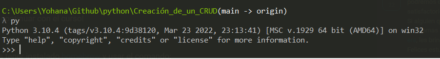
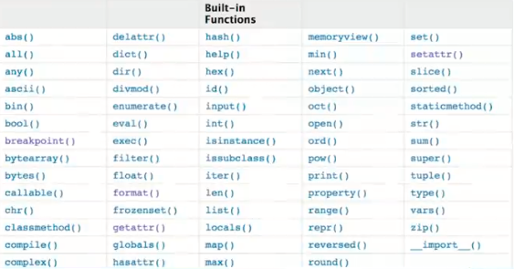

# Creación de un CRUD con python

### Introducción
- [Básicos del lenguaje](#Introducción)
    - [Guia de instalación y conceptos básicos](#Qué_necesitas_saber_para_tomar_el_curso)
    - [IMPORTANTE: instalación Ubuntu Bash en windows para facilitarte el seguimiento del curso desde windows](#comó_organizar_las_carpetas_de_tus_proyectos)
    - [¿Qué es la programación?](#que_es_la_programacion)
    - [¿Por qué programar con Python?](#que_es_la_programacion)
    - [Operadores matemáticos](#que_es_la_programacion)
    - [Variables y expresiones](#que_es_la_programacion)
    - [Presentación del proyecto](#que_es_la_programacion)
    - [Funciones](#que_es_la_programacion)
    - [Usando funciones en nuestro proyecto](#que_es_la_programacion)
    - [Operadores lógicos](#que_es_la_programacion)
    - [Estructura condicionales](#que_es_la_programacion)
- [Static Typing](#Static_typing)
    - [¿Qué son los tipados?](#Qué_son_los_tipados)
    - [Tipado estático en python](#Tipado_estático_en_python)
    - [Practicando el tipado estático](#Practicando_el_tipado_estático)
- [Conceptos avanzados de funciones](#Linked_lists)
    - [Scope: alcance de las variables](#Nodos_y_singly_linked_list)
    - [Closures](#Crear_nodos)
    - [Programando closures](#Crear_singly_linked_lists)
    - [Decoradores](#Operaciones_en_single_linked_structures)
    - [Programando decoradores](#Operaciones_a_detalle)
- [Estructura de datos avanzadas](#Stacks)
    - [Iteradores](#Que_son_stacks)
    - [La sucesión de Fibonacci](#crear_stack)
    - [Generadores](#Que_son_stacks)
    - [Mejorando nuestra sucesión de Fibonacci](#crear_stack)
    - [sets](#Que_son_stacks)
    - [Operaciones con sets](#crear_stack)
    - [Eliminando los repetidos de una lista](#Que_son_stacks)
- [Bonus](#Queues)
    - [Manejo de fechas](#Que_son_los_queues)
    - [Time zones](#Queue_basada_en_listas)

# Básicos del lenguaje

### Guia de instalación y conceptos básicos

#### ¿Qué es Python?

Python es un lenguaje de programación creado por Guido Van Rossum, con una sintaxis muy limpia, ideado para enseñar a la gente a programar bien. Se trata de un lenguaje interpretado o de script.

#### Ventajas:

- **Legible:** sintaxis intuitiva y estricta.
- **Productivo:** ahorra mucho código.
- **Portable:** para todo sistema operativo.
- **Recargado:** viene con muchas librerías por defecto.

#### Instalación
Existen dos versiones de Python que tienen gran uso actualmente, Python 2.x y Python 3.x, para este curso necesitas usar una versión 3.x

Para instalar Python solo debes seguir los pasos dependiendo del sistema operativo que tengas instalado.

#### Windows
Para instalar Python en Windows ve al sitio https://www.python.org/downloads/ y presiona sobre el botón Download Python 3.7.3

Se descargará un archivo de instalación con el nombre python-3.7.3.exe , ejecútalo. Y sigue los pasos de instalación.

Al finalizar la instalación haz lo siguiente para corroborar una instalación correcta

- Presiona las teclas Windows + R para abrir la ventana de Ejecutar.
- Una vez abierta la ventana Ejecutar escribe el comando cmd y presiona ctrl+shift+enter para ejecutar una línea de comandos con permisos de administrador.
- Windows te preguntará si quieres abrir el Procesador de comandos de Windows con permisos de administrador, presiona sí.
- En la línea de comandos escribe py o python

Tu consola se mostrará así.



¡Ya estás listo para continuar con el curso!

#### MacOS

La forma sencilla es tener instalado homebrew y usar el comando:

**Para instalar la Versión 2.7**

`brew install python`

**Para instalar la Versión 3.x**

`brew install python3`

#### Linux

Generalmente Linux ya lo trae instalado, para comprobarlo puedes ejecutar en la terminal el comando

**Versión 2.7**

`python -v`

**Versión 3.x**

`python3 -v`

Si el comando arroja un error quiere decir que no lo tienes instalado, en ese caso los pasos para instalarlo cambian un poco de acuerdo con la distribución de linux que estés usando. Generalmente el gestor de paquetes de la distribución de Linux tiene el paquete de Python

Si eres usuario de Ubuntu o Debian por ejemplo puedes usar este comando para instalar la versión 3.1:

`$ sudo apt-get install python3.1`

Si eres usuario de Red Hat o Centos por ejemplo puedes usar este comando para instalar python

`$ sudo yum install python`

Si usas otra distribución o no has podido instalar python en tu sistema Linux dejame un comentario y vemos tu caso específico.

Si eres usuario habitual de linux también puedes descargar los archivos para instalarlo manualmente.

**Antes de empezar:**

Para usar Python debemos tener un editor de texto abierto y una terminal o cmd (línea de comandos en Windows) como administrador.

No le tengas miedo a la consola, la consola es tu amiga.

Para ejecutar Python abre la terminal y escribe:

`python`

Te abrirá una consola de Python, lo notarás porque el prompt cambia y ahora te muestra tres simbolos de mayor que “ >>> “ y el puntero adelante indicando que puedes empezar a ingresar comandos de python.

 `>>> `

En éste modo puedes usar todos los comandos de Python o escribir código directamente.

*Si deseas ejecutar código de un archivo sólo debes guardarlo con extension.py y luego ejecutar en la terminal:

` $ python archivo.py`

Ten en cuenta que para ejecutar el archivo con extensión “.py” debes estar ubicado en el directorio donde tienes guardado el archivo.

**Para salir de Python** y regresar a la terminal debes usar el comando exit()

Cuando usamos Python debemos atender ciertas reglas de la comunidad para definir su estructura. Las encuentras en el libro **PEP8**.

#### Tipos de datos en Python

- **Enteros (int):** en este grupo están todos los números, enteros y long:

ejemplo: 1, 2.3, 2121, 2192, -123

- **Booleanos (bool):** Son los valores falso o verdadero, compatibles con todas las operaciones booleanas ( and, not, or ):

 ejemplo: True, False

- **Cadenas (str):** Son una cadena de texto :

 ejemplos: “Hola”, “¿Cómo estas?”

- **Listas:** Son un grupo o array de datos, puede contener cualquiera de los datos anteriores:

 ejemplos: [1,2,3, ”hola” , [1,2,3] ], [1,“Hola”,True ]

- **Diccionarios:** Son un grupo de datos que se acceden a partir de una clave:

ejemplo: {“clave”:”valor”}, {“nombre”:”Fernando”}

- **Tuplas:** también son un grupo de datos igual que una lista con la diferencia que una tupla después de creada no se puede modificar.

ejemplos: (1,2,3, ”hola” , (1,2,3) ), (1,“Hola”,True ) 
(Pero jamás podremos cambiar los elementos dentro de esa Tupla)

En Python trabajas con módulos y ficheros que usas para importar las librerías.

#### Funciones

Las funciones las defines con **def** junto a un nombre y unos paréntesis que reciben los parámetros a usar. Terminas con dos puntos.

`def nombre_de_la_función(parametros):`

Después por indentación colocas los datos que se ejecutarán desde la función:

```python
 >>> def my_first_function():
 ...	return “Hello World!” 
 ...    
 >>> my_first_function()
    Hello World!
```

#### Variables

Las variables, a diferencia de los demás lenguajes de programación, no debes definirlas, ni tampoco su tipo de dato, ya que al momento de iterarlas se identificará su tipo. Recuerda que en Python todo es un objeto.

 ```python
 A = 3 
 B = A
 ```

#### Listas

Las listas las declaras con corchetes. Estas pueden tener una lista dentro o cualquier tipo de dato.

```python
 >>> L = [22, True, ”una lista”, [1, 2]] 
 >>> L[0] 
 22
 ```

#### Tuplas

Las tuplas se declaran con paréntesis, recuerda que no puedes editar los datos de una tupla después de que la has creado.

```python
 >>> T = (22, True, "una tupla", (1, 2)) 
 >>> T[0] 
 22
```

#### Diccionarios

**En los diccionarios tienes un grupo de datos con un formato:** la primera cadena o número será la clave para acceder al segundo dato, el segundo dato será el dato al cual accederás con la llave. Recuerda que los diccionarios son listas de llave:valor.

```python
 >>> D = {"Kill Bill": "Tamarino", "Amelie": "Jean-Pierre Jeunet"} 
 >>> D["Kill Bill"]
    "Tamarino"
```

#### Conversiones

- De flotante a entero:

```python
 >>> int(4.3)
 4
```

- De entero a flotante:

```python
 >>> float(4) 
 4.0
```

- De entero a string:

```python
 >>> str(4.3) 
 "4.3"
```

- De tupla a lista:

```python
 >>> list((4, 5, 2)) 
 [4, 5, 2]
```

#### Operadores Comunes

- Longitud de una cadena, lista, tupla, etc.:

```python
 >>> len("key") 
 3
```

- Tipo de dato:

```python
 >>> type(4) 
 < type int >
```

- Aplicar una conversión a un conjunto como una lista:

```python
 >>> map(str, [1, 2, 3, 4])
 ['1', '2', '3', '4']
```

- Redondear un flotante con x número de decimales:

```python
>>> round(6.3243, 1)
 6.3
```

- Generar un rango en una lista (esto es mágico):

```python
 >>> range(5) 
 [0, 1, 2, 3, 4]
```

- Sumar un conjunto:

```python
 >>> sum([1, 2, 4]) 
 7
```

- Organizar un conjunto:

```python
 >>> sorted([5, 2, 1]) 
 [1, 2, 5]
```

- Conocer los comandos que le puedes aplicar a x tipo de datos:

```python
 >>>Li = [5, 2, 1]
 >>>dir(Li)
 >>>['append', 'count', 'extend', 'index', 'insert', 'pop', 'remove', 'reverse', 'sort']
```

‘append’, ‘count’, ‘extend’, ‘index’, ‘insert’, ‘pop’, ‘remove’, ‘reverse’, ‘sort’ son posibles comandos que puedes aplicar a una lista.

#### Información sobre una función o librería:

```python
 >>> help(sorted) 
```

 (Aparecerá la documentación de la función sorted)

#### Clases

Clases es uno de los conceptos con más definiciones en la programación, pero en resumen sólo son la representación de un objeto. Para definir la clase usas_ class_ y el nombre. En caso de tener parámetros los pones entre paréntesis.

Para crear un constructor haces una función dentro de la clase con el nombre init y de parámetros self (significa su clase misma), nombre_r y edad_r:

```python
 >>> class Estudiante(object): 
 ... 	def __init__(self,nombre_r,edad_r): 
 ... 		self.nombre = nombre_r 
 ... 		self.edad = edad_r 
 ...
 ... 	def hola(self): 
 ... 		return "Mi nombre es %s y tengo %i" % (self.nombre, self.edad) 
 ... 
 >>> e = Estudiante(“Arturo”, 21) 
 >>> print (e.hola())
 Mi nombre es Arturo y tengo 21
```
Lo que hicimos en las dos últimas líneas fue:

1. En la variable e llamamos la clase Estudiante y le pasamos la cadena “Arturo” y el entero 21.

2. Imprimimos la función hola() dentro de la variable e (a la que anteriormente habíamos pasado la clase).

Y por eso se imprime la cadena “Mi nombre es Arturo y tengo 21”

#### Métodos especiales

- cmp(self,otro)

Método llamado cuando utilizas los operadores de comparación para comprobar si tu objeto es menor, mayor o igual al objeto pasado como parámetro.

- len(self)

Método llamado para comprobar la longitud del objeto. Lo usas, por ejemplo, cuando llamas la función len(obj) sobre nuestro código. Como es de suponer el método te debe devolver la longitud del objeto.

- init(self,otro)

Es un constructor de nuestra clase, es decir, es un “método especial” que se llama automáticamente cuando creas un objeto.

- Condicionales IF

Los condicionales tienen la siguiente estructura. Ten en cuenta que lo que contiene los paréntesis es la comparación que debe cumplir para que los elementos se cumplan.

```python
 if ( a > b ):
 	elementos 
 elif ( a == b ): 
 	elementos 
 else:
 	elementos
```

#### Bucle FOR

El bucle de for lo puedes usar de la siguiente forma: recorres una cadena o lista a la cual va a tomar el elemento en cuestión con la siguiente estructura:

```python
 for i in ____:
 	elementos
```

Ejemplo:

```python
 for i in range(10):
 	print i
```

En este caso recorrerá una lista de diez elementos, es decir el _print i _de ejecutar diez veces. Ahora i va a tomar cada valor de la lista, entonces este for imprimirá los números del 0 al 9 (recordar que en un range vas hasta el número puesto -1).

#### Bucle WHILE

En este caso while tiene una condición que determina hasta cuándo se ejecutará. O sea que dejará de ejecutarse en el momento en que la condición deje de ser cierta. La estructura de un while es la siguiente:

```python
 while (condición):
 	elementos
```

Ejemplo:

```python
 >>> x = 0 
 >>> while x < 10: 
 ... 	print x 
 ... 	x += 1
 ```

En este ejemplo preguntará si es menor que diez. Dado que es menor imprimirá x y luego sumará una unidad a x. Luego x es 1 y como sigue siendo menor a diez se seguirá ejecutando, y así sucesivamente hasta que x llegue a ser mayor o igual a 10.

Cómo seguir

No te preocupes si en este punto no entiendes algunos de estos conceptos, sigue con el curso donde vamos a realizar ejercicios que te ayuden a comprender y poder aplicar cada una de las características de Python.

Adelante!

### ¿Qué es la programación?

Es una disciplina que combina parte de otras disciplinas como las Matemáticas, Ingeniería y la Ciencia. Sin embargo, la habilidad más importante es resolver problemas. Es lo que harás todos los días como programador o programadora.

La programación es una secuencia de instrucciones que le damos a la computadora para que haga lo que nosotros deseamos. Podemos construir una aplicación web, móvil, un programa que lleve cohetes a la luna o marte, resolver problemas de finanzas.

La estructura de un programa. Casi todos los programas tienen un :
- input, 
- output, 
- operaciones matemáticas, 
- ejecución condicional y repeticiones

### ¿Por qué programar con Python?

Python es uno de los mejores lenguajes para principiantes porque tiene una sintaxis clara, una gran comunidad y esto hace que el lenguaje sea muy amigable para los que están iniciando.

Python esta diseñado para ser fácil de usar, a diferencia de otros lenguajes donde la prioridad es ser rápido y eficiente. Python no es de los lenguajes más rápidos, pero casi nunca importa.

Es el tercer lenguaje, según Github, entre los más populares. En StackOverflow se comenta que es uno de los lenguajes que mayor popularidad esta obteniendo.

““Python cuando podamos, C++ cuando necesitemos””

python --version para conocer la versión que tenemos instalada
python [nombre del archivo] para ejecutar nuestro programa

### Operadores matemáticos

En programación estos operadores son muy similares a nuestras clases básicas de matemáticas.

- //: Es división de entero, básicamente tiramos la parte decimal
- %: Es el residuo de la división, lo que te sobra.
- **: Exponente

```python
>>> 1+2    
3          
>>> 2-5    
-3         
>>> 10/4   
2.5        
>>> 10 // 4
2          
>>> 10 % 4 
2          
>>> 20 % 5 
0          
>>> 10 * 2 
20         
>>> 2 ** 8 
256        
>>> 'a' + 'b'
'ab'
>>> 'b' * 5
'bbbbb'       
```

Los operadores son contextuales, dependen del tipo de valor. Un valor es la representación de una entidad que puede ser manipulada por un programa.

Podemos conocer el tipo del valor con **type()** y nos devolverá algo similar a <class 'init'>, <class 'float'>, <class 'str'>. Dependiendo del tipo los operadores van a funcionar de manera diferente.

#### Operadores lógicos: 

Sirven para realizar comparaciones, devuelven un valor verdadero o falso.

| Operador	|Descripción				| Ejemplo|
| ----------- | ----------------------------  |------------- |
| and	      |¿se cumple a y b? 	          | r=True and False # r es False |
| or	      |¿se cumple a o b?	          | r=True o False # r es True |
| not	      | No a						  | r=not True #r es False |

#### Operadores relacionales: 

comparan dos expresiones y devuelven un valor verdadero o falso.

|Operador	    | Descripción 					|	Ejemplo|
| ------------- | ----------------------------  |------------- |
| == 			|	¿Son iguales a y b?			| r=5==3 # r es False|
| != 			|	¿Son distintos a y b?		| r=5!=3 # r es True |
| < 			|	¿Es a menor que b?			| r=5<3 # r es False |
| > 			|	¿Es a mayor que b?			| r=5>3 3 r es True  |
| <= 			|	¿Es a menor o igual que b?	| r=5<=5 # r es True |
| >= 			|	¿Es a mayor o igual que b?	| r=5>=3 # r es True |

### Variables y expresiones

Una variable es simplemente el contenedor de un valor. Es una forma de decirle a la computadora de que nos guarde un valor para luego usarlo.

Python es un lenguaje dinámico, este concepto de privado y público se genera por convenciones del lenguaje. En programación el signo = significa asignación.

Si una variable esta en mayúscula, usualmente se refiere a una constante, no debería reasignarse. Es una convención.

- message = 'How are you?'
- _age = 20 // variable privada
- PI = 3.14159
- __do_not_touch = 'something important' // variable que no debe modificarse

#### Reglas de Variables:

1. Pueden contener números y letras
2. No deben comenzar con número
3. Múltiples palabras se unen con _
4. No se pueden utilizar palabras reservadas

Expresiones son instrucciones para el interprete para evaluar la expresión. Los enunciados tienen efectos dentro del programa, como print que genera un output.

**orden de operaciones**

PEMDAS = Paréntesis, Exponente, Multiplicación-División, Adición-Sustracción

### Funciones

En el contexto de la programación las funciones son simplemente una agrupación de enunciados(statments) que tienen un nombre. Una función tiene un nombre, debe ser descriptivo, puede tener parámetros y puede regresar un valor después que se generó el cómputo.

Python es un lenguaje que se conoce como batteries include(baterías incluidas) esto significa que tiene una librería estándar con muchas funciones y librerías.

Para declarar funciones que no son las globales, las built-in functions, necesitamos importar un módulo.

Con el keyword **def** declaramos una función.



Otras funciones se pueden encontrar en módulos
- Para utilizarlas es necesario importar el módulo
    - Ejm: import math
- Para declarar una función, utilizamos el keyword **def**
    - Ej. def my_function(first_arg, second_arg=None)
- Las funciones se pueden componer.
    - Ej. def sum_two_numbers(x,y):
        return x + y

        other_function(sum_two_numbers(3,4))
- Los argumentos pueden ser posicionales o con nombre
    - Los parámetros y variables son locales a la función
        - global keyword
    - orden de ejecución:
        - Arriba para abajo
        - Izquierda a derecha

### Estructuras condicionales

- Una expresión booleana siempre se evalua como dos opciones verdadero (True) o como falso (False)
- Operadores de comparación
    - x = 2
    - y = 3
    - x == y
    - x != y
    - x > y
    - x < y
    - x >= y
    - x <= y

- Operadores logicos

- **and:** unicamente es verdadero cuando ambos valores son verdaderos

|X	    | Y 	 |	AND  |
| ------| ------ |------ |
| T 	|	T	 | T     |
| T 	|	F	 | F     |
| F 	|	T	 | F     |
| F 	|	F	 | F     |

- **or** es verdadero cuando uno de los dos valores es verdadero.

| X	    |   Y 	 |	OR  |
| ----- | ------ |----- |
| T 	|	T	 | T    |
| T 	|	F	 | T    |
| F 	|	T	 | T    |
| F 	|	F	 | F    |

- **not** es lo contrario al valor. Falso es Verdadero. Verdadero es Falso.

|X	    |  Y 	 |
| ------| ------ |
| T 	|	F	 |
| F 	|	T	 | 

### Strings en Python 

- Los strings o cadenas de textos tienen un comportamiento distinto a otros tipos como los booleanos, enteros, floats.
    - Las cadenas son secuencias
    - Las secuencias  todas se pueden acceder a través de un índice.
        - apple = 'apple'
          apple[1]
- Podemos saber la longitud de un string, cuántos caracteres se encuentran en esa secuencia. 
    - Lo podemos saber con la built-in function global llamada len.
        - len(apple)
- Algo importante a tener en cuenta cuando hablamos de strings es que estos son inmutables, esto significa que cada vez que modificamos uno estamos generando un nuevo objeto en memoria.
    - id(apple) 

> id nos permite saber donde vive esta variable id(apple)

# Operaciones con Strings en Python
Los strings tienen varios métodos que nosotros podemos utilizar.

- upper: convierte todo el string a mayúsculas
- lower: convierte todo el string a minúsculas
- find: encuentra el indice en donde existe un patrón que nosotros definimos
- startswith: significa que empieza con algún patrón.
- endswith: significa que termina con algún patrón
- capitalize: coloca la primera letra en mayúscula y el resto en minúscula.
- in y not in nos permite saber con cualquier secuencia sin una subsecuencia o substrings se encuentra adentro de la secuencia mayor.
- dir: Nos dice todos los métodos que podemos utilizar dentro de un objeto.
- help: nos imprime en pantalla el docstrings o comentario de ayuda o instrucciones que posee la función. Casi todas las funciones en Python las tienen.

```python
>>> platzi = 'platzi'
>>> platzi.upper()
'PLATZI'
>>> platzi.find('la')
1
>>> platzi.startswith('p')
True
>>> platzi.startswith('x')
False
```
### Operaciones con strings: Slices en python

Los slices en Python nos permiten manejar secuencias de una manera poderosa.

Slices en español significa ““rebanada””, si tenemos una secuencia de elementos y queremos una rebanada tenemos una sintaxis para definir qué pedazos queremos de esa secuencia.

```python
secuencia[comienzo:final:pasos]

>>> fruit = 'banana'
>>> fruit[:3]
'ban'
>>> fruit[3:]
'ana'
>>> fruit[3:3]
''
>>> fruit[:]
'banana'
>>> fruit[1:-1:2]
'aa'
>>> fruit[::-1]
'ananab'
```

### For loops

Las iteraciones es uno de los conceptos más importantes en la programación. En Python existen muchas manera de iterar pero las dos principales son los for loops y while loops.

Los for loops nos permiten iterar a través de una secuencia y los while loops nos permiten iterara hasta cuando una condición se vuelva falsa.

- Tienen dos keywords break y continue que nos permiten salir anticipadamente de la iteración
- Se usan cuando se quiere ejecutar varias veces una o varias instrucciones.
- for [variable] in [secuencia]:

Es una convención usar la letra i como variable en nuestro for, pero podemos colocar la que queramos.

range: Nos da un objeto rango, es un iterador sobre el cual podemos generar secuencias.

### While loops

Al igual que las for loops, las while loops nos sirve para iterar, pero las for loops nos sirve para iterar a lo largo de una secuencia mientras que las while loops nos sirve para iterar mientras una condición sea verdadera.

```python
def cuenta_regresiva(n):
    while n > 0:
        print(n)
        n- = 1
```

Si no tenemos un mecanismo para convertir el mecanismo en falsedad, entonces nuestro while loops se ira al infinito(infinite loop).

### Iterators and generators

Aunque no lo sepas, probablemente ya utilices iterators en tu vida diaria como programador de Python. Un iterator es simplemente un objeto que cumple con los requisitos del Iteration Protocol (protocolo de iteración) y por lo tanto puede ser utilizado en ciclos. Por ejemplo,

```python
for i in range(10):
    print(i)
```

En este caso, la función range es un iterable que regresa un nuevo valor en cada ciclo. Para crear un objeto que sea un iterable, y por lo tanto, implemente el protocolo de iteración, debemos hacer tres cosas:

- Crear una clase que implemente los métodos iter y next
- iter debe regresar el objeto sobre el cual se iterará
- next debe regresar el siguiente valor y aventar la excepción StopIteration cuando ya no hayan elementos sobre los cual iterar.

Por su parte, los generators son simplemente una forma rápida de crear iterables sin la necesidad de declarar una clase que implemente el protocolo de iteración. Para crear un generator simplemente declaramos una función y utilizamos el keyword yield en vez de return para regresar el siguiente valor en una iteración. Por ejemplo,

```python
def fibonacci(max):
    a, b = 0, 1
    while a < max:
        yield a
        a, b = b, a+b
```

Es importante recalcar que una vez que se ha agotado un generator ya no podemos utlizarlo y debemos crear una nueva instancia. Por ejemplo,

```python
fib1 = fibonacci(20)
fib_nums = [num for num in fib1]
...
double_fib_nums = [num * 2 for num in fib1] # no va a funcionar
double_fib_nums = [num * 2 for num in fibonacci(30)] # sí funciona
```

### Uso de listas

Python y todos los lenguajes nos ofrecen constructos mucho más poderosos, haciendo que el desarrollo de nuestro software sea

- Más sofisticado
- Más legible
- Más fácil de implementar

Estos constructos se llaman Estructuras de Datos que nos permiten agrupar de distintas maneras varios valores y elementos para poderlos manipular con mayor facilidad.

Las listas las vas a utilizar durante toda tu carrera dentro de la programación e ingeniería de Software.

Las listas son una secuencia de valores. A diferencia de los strings, las listas pueden tener cualquier tipo de valor. También, a diferencia de los strings, son mutables, podemos agregar y eliminar elementos.

En Python, las listas son referenciales. Una lista no guarda en memoria los objetos, sólo guarda la referencia hacia donde viven los objetos en memoria

Se inician con [] o con la built-in function list.

**Listas en python**
- Como los strings, las listas son secuencias de valores.
    - En las listas, los valores pueden tener cualquier tipo
- Ejm.
    - [2,5,6]
    - ['Colombia', 'Mexico', 'Argentina']
    - ['Tacos', 3, 'arepas', 6, 'chorizo', 9]
- Las listas son mutables, a diferencia de los strings
    - my_list = [1,2,3]
    - my_list[2] = 6
- Los indices de las listas, funcionan igual que los de los string
- Las listas se inician con [] o con la función list

En las listas hay que tener cuidado al momento de igualar una lista con otra pues cuando se modifica pasa como esto:

```python
>>> country = ['Ecuador','Venezuela', 'Colombia', 'Argentina']
>>> id(country)
1867967259456
>>> global_country = country
>>> id(global_country)
1867967259456
>>> country[0] = 'Guatemala'
>>> country
['Guatemala', 'Venezuela', 'Colombia', 'Argentina']
>>> global_country
['Guatemala', 'Venezuela', 'Colombia', 'Argentina']
```

Si queremos hacer esto pero que no se modifique la lista lo podemos hacer como se muestra a continuación habria que importar el modulo copy.

```python
>>> import copy
>>> countries = ['Guatemala', 'Venezuela', 'Colombia', 'Argentina']
>>> global_countries = None
>>> global_countries = copy.copy(countries)
>>> countries
['Guatemala', 'Venezuela', 'Colombia', 'Argentina']
>>> countries[0] = 'Perú'
>>> countries
['Perú', 'Venezuela', 'Colombia', 'Argentina']
>>> global_countries
['Guatemala', 'Venezuela', 'Colombia', 'Argentina']
```

Recorrer una lista

```python
>>> for country in countries:
...     print(country)
...
Perú
Venezuela
Colombia
Argentina
```

### Operaciones con listas

Ahora que ya entiendes cómo funcionan las listas, podemos ver qué tipo de operaciones y métodos podemos utilizar para modificarlas, manipularlas y realizar diferentes tipos de cómputos con esta Estructura de Datos.

- El operador +(suma) concatena dos o más listas.
    - Ej.
      - a = [1,2]
      - b = [2,3]
      - a + b = [1, 2, 2, 3]

- El operador *(multiplicación) repite los elementos de la misma lista tantas veces los queramos multiplicar
    - Ej.
      - a = [1,2]
      - a *2 = [1,2,1,2]

Sólo podemos utilizar +(suma) y *(multiplicación).

**Las listas tienen varios métodos que podemos utilizar.**

- **append** nos permite añadir elementos a listas. Cambia el tamaño de la lista.
    - Ej.
        - a = [1]
        - a.append(2) #[1,2]
- **pop** nos permite sacar el último elemento de la lista. También recibe un índice y esto nos permite elegir qué elemento queremos eliminar.
    - Ej.
        - a = [1,2]
        - b = a.pop()
        - print(a) #1
        - print(b) #2

- **sort** modifica la propia lista y ordenarla de mayor a menor. Existe otro método llamado sorted, que también ordena la lista, pero genera una nueva instancia de la lista
    - Ej.
        - a = [3,8,1]
        - a.sort() # [1,3,8]
    
- **del** nos permite eliminar elementos vía indices, funciona con slices
    - Ej.
        - a = [1,2,3]
        - del a[-1]

- **remove** nos permite es pasarle un valor para que Python compare internamente los valores y determina cuál de ellos hace match o son iguales para eliminarlos.

```python
>>> a = list(range(0,100,2))
>>> b = list(range(0,10))
>>> b
[0, 1, 2, 3, 4, 5, 6, 7, 8, 9]
>>> a
[0, 2, 4, 6, 8, 10, 12, 14, 16, 18, 20, 22, 24, 26, 28, 30, 32, 34, 36, 38, 40, 42, 44, 46, 48, 50, 52, 54, 56, 58, 60, 62, 64, 66, 68, 70, 72, 74, 76, 78, 80, 82, 84, 86, 88, 90, 92, 94, 96, 98]
>>> a + b
[0, 2, 4, 6, 8, 10, 12, 14, 16, 18, 20, 22, 24, 26, 28, 30, 32, 34, 36, 38, 40, 42, 44, 46, 48, 50, 52, 54, 56, 58, 60, 62, 64, 66, 68, 70, 72, 74, 76, 78, 80, 82, 84, 86, 88, 90, 92, 94, 96, 98, 0, 1, 2, 3, 4, 5, 6, 7, 8, 9]
>>> b
[0, 1, 2, 3, 4, 5, 6, 7, 8, 9]
>>> b * 2
[0, 1, 2, 3, 4, 5, 6, 7, 8, 9, 0, 1, 2, 3, 4, 5, 6, 7, 8, 9]
>>> fruits = list()          
>>> fruits                   
[]                           
>>> fruits.append('apple')   
>>> fruits                   
['apple']                    
>>> len(fruits)              
1                            
>>> fruits.append('banana')  
>>> fruits                   
['apple', 'banana']          
>>> len(fruits)              
2
>>> some_fruit = fruits.pop()
>>> some_fruit
'banana'
>>> fruits.append('banana')
>>> fruits.append('kiwi')
>>> some_fruit = fruits.pop(0)
>>> some_fruit
'apple'
>>> del fruits[0]
>>> fruits
['kiwi'] 
>>> import random
>>>
>>> random_numbers = []
>>> for i in range(10):
...     random_numbers.append(random.randint(0,15))
...
>>> random_numbers
[14, 11, 9, 2, 3, 7, 2, 5, 15, 11]
>>> ordered_numbers = sorted(random_numbers)
>>> ordered_numbers
[2, 2, 3, 5, 7, 9, 11, 11, 14, 15]
>>> random_numbers
[14, 11, 9, 2, 3, 7, 2, 5, 15, 11]                          
```

### Diccionarios

Los diccionarios se conocen con diferentes nombres a lo largo de los lenguajes de programación como HashMaps, Mapas, Objetos, etc. En Python se conocen como Diccionarios.

Un diccionario es similar a una lista sabiendo que podemos acceder a través de un indice, pero en el caso de las listas este índice debe ser un número entero. Con los diccionarios puede ser cualquier objeto, normalmente los verán con strings para ser más explicitos, pero funcionan con muchos tipos de llaves…

Un diccionario es una asociación entre llaves(keys) y valores(values) y la referencia en Python es muy precisa. Si abres un diccionario verás muchas palabras y cada palabra tiene su definición.

Para iniciar un diccionario se usa {} o con la función dict
    - Ejm.
    - productos = {}
    - productos['leche'] = 23.50

Estos también tienen varios métodos. Siempre puedes usar la función dir para saber todos los métodos que puedes usar con un objeto.

Si queremos ciclar a lo largo de un diccionario tenemos las opciones:

- keys: nos imprime una lista de las llaves
    - Ejm.
        - for key in my_dict_keys():
            pass
- values nos imprime una lista de los valores
    - Ejm.
    - for values in my_dict_values():
        pass
- items. nos manda una lista de tuplas de los valores
    - Ejm.
        - for key, value in my_dict_items():
            pass

```python
>>> rae = {}
>>> rae['pizza'] = 'La comida mas deliciosa del mundo'
>>> rae
{'pizza': 'La comida mas deliciosa del mundo'}
>>> rae['pasta'] = 'La comida mas sabrosa de italia'
>>> rae.keys()
dict_keys(['pizza', 'pasta'])
>>> rae.values()
dict_values(['La comida mas deliciosa del mundo', 'La comida mas sabrosa de italia'])
>>> rae.items()
dict_items([('pizza', 'La comida mas deliciosa del mundo'), ('pasta', 'La comida mas sabrosa de italia')])
>>> for key in rae.keys():
...     print(key)
...
pizza
pasta
>>> for values in rae.values():
...     print(values)
...
La comida mas deliciosa del mundo
La comida mas sabrosa de italia
>>> for keys,values in rae.items():
...     print(keys, values)
...
pizza La comida mas deliciosa del mundo
pasta La comida mas sabrosa de italia
```

### Tuplas y conjuntos

- Tuplas(tuples) son iguales a las listas, la única diferencia es que son inmutables, la diferencia con los strings es que pueden recibir muchos tipos valores. Son una serie de valores separados por comas, casi siempre se le agregan paréntesis para que sea mucho más legible.
    - Ejm.
        - Tup = 1,2,3
        - tup = (1,2,3)

- Para poderla inicializar utilizamos la función tuple.

- Uno de sus usos muy comunes es cuando queremos regresar más de un valor en nuestra función.
    - Ejm.
        - return(students, teachers)

Una de las características de las Estructuras de Datos es que cada una de ellas nos sirve para algo especifico. No existe en programación una navaja suiza que nos sirva para todos. Los mejores programas son aquellos que utilizan la herramienta correcta para el trabajo correcto.

Conjutos(sets) nacen de la teoría de conjuntos. Son una de las Estructuras más importantes y se parecen a las listas, podemos añadir varios elementos al conjunto, pero no pueden existir elementos duplicados. A diferencia de los tuples podemos agregar y eliminar, son mutables.

Los sets se pueden inicializar con la función set. Una recomendación es inicializarlos con esta función para no causar confusión con los diccionarios.

add nos sirve añadir elementos.
remove nos permite eliminar elementos

```python
>>> a = 1, 2, 3
>>> type(a)
<class 'tuple'>
>>> a = (1, 2, 3)
>>> type(a)
<class 'tuple'>
>>> a[1]
2
>>> a = (1, 1, 2, 3, 4)
>>> dir(a)
['__add__', '__class__', '__class_getitem__', '__contains__', '__delattr__', '__dir__', '__doc__', '__eq__', '__format__', '__ge__', '__getattribute__', '__getitem__', '__getnewargs__', '__gt__', '__hash__', '__init__', '__init_subclass__', '__iter__', '__le__', '__len__', '__lt__', '__mul__', '__ne__', '__new__', '__reduce__', '__reduce_ex__', '__repr__', '__rmul__', '__setattr__', '__sizeof__', '__str__', '__subclasshook__', 'count', 'index']
# Cuenta las veces que se encuentra un elemento.
>>> a.count(2)
1             
>>> a.count(1)
2     
# Indica el indice donde se encuentra el elemento
>>> a.index(1)
0             
>>> a.index(3)
3
>>> a = set([1, 2, 3])
>>> a.add(5)
>>> a
{1, 2, 3, 5}                     
```

**Operadores para sets**

```python
>>> A = {1, 2, 3}	# conjunto A
>>> B = {3, 4 ,5}	# conjunto B
>>> A | B		#unión
{1, 2, 3, 4, 5}
>>> A & B	# intersección
{3}
>>> A - B		# diferencia entre A y B
{1, 2}
>>> B - A		# diferencia entre B y A
{4, 5}
```

### Introducción al módulo collections

El módulo collections nos brinda un conjunto de objetos primitivos que nos permiten extender el comportamiento de las built-in collections que poseé Python y nos otorga estructuras de datos adicionales. Por ejemplo, si queremos extender el comportamiento de un diccionario, podemos extender la clase UserDict; para el caso de una lista, extendemos UserList; y para el caso de strings, utilizamos UserString.

Por ejemplo, si queremos tener el comportamiento de un diccionario podemos escribir el siguiente código:

```python
class SecretDict(collections.UserDict):

   def _password_is_valid(self, password):
        …

    def _get_item(self, key):
        … 

    def __getitem__(self, key):
         password, key = key.split(‘:’)
         
         if self._password_is_valid(password):
              return self._get_item(key)
         
         return None

my_secret_dict = SecretDict(...)
my_secret_dict[‘some_password:some_key’] # si el password es válido, regresa el valor
```
Otra estructura de datos que vale la pena analizar, es namedtuple. Hasta ahora, has utilizado tuples que permiten acceder a sus valores a través de índices. Sin embargo, en ocasiones es importante poder nombrar elementos (en vez de utilizar posiciones) para acceder a valores y no queremos crear una clase ya que únicamente necesitamos un contenedor de valores y no comportamiento.

```python
Coffee = collections.NamedTuple(‘Coffee’, (‘size’, ‘bean’, ‘price’))
def get_coffee(coffee_type):
     If coffee_type == ‘houseblend’:
         return Coffee(‘large’, ‘premium’, 10)
```

El módulo collections también nos ofrece otros primitivos que tienen la labor de facilitarnos la creación y manipulación de colecciones en Python. Por ejemplo, Counter nos permite contar de manera eficiente ocurrencias en cualquier iterable; OrderedDict nos permite crear diccionarios que poseen un orden explícito; deque nos permite crear filas (para pilas podemos utilizar la lista).

En conclusión, el módulo collections es una gran fuente de utilerías que nos permiten escribir código más “pythonico” y más eficiente.

### Python comprehensions

Las Comprehensions son constructos que nos permiten generar una secuencia a partir de otra secuencia.

Existen tres tipos de comprehensions:

- List comprehensions

```python
[element for element in element_list if element_meets_condition]
```
- Dictionary comprehensions

```python
{key: element for element in element_list if element_meets_condition}
```

- Sets comprehensions

```python
{element for element in element_list if elements_meets_condition}
```

```python
>>> lista_de_numeros = list(range(100))
>>> lista_de_numeros
[0, 1, 2, 3, 4, 5, 6, 7, 8, 9, 10, 11, 12, 13, 14, 15, 16, 17, 18, 19, 20, 21, 22, 23, 24, 25, 26, 27, 28, 29, 30, 31, 32, 33, 34, 35, 36, 37, 38, 39, 40, 41, 42, 43, 44, 45, 46, 47, 48, 49, 50, 51, 52, 53, 54, 55, 56, 57, 58, 59, 60, 61, 62, 63, 64, 65, 66, 67, 68, 69, 70, 71, 72, 73, 74, 75, 76, 77, 78, 79, 80, 81, 82, 83, 84, 85, 86, 87, 88, 89, 90, 91, 92, 93, 94, 95, 96, 97, 98, 99]
# list comprenhensions
>>> pares = [element for element in lista_de_numeros if element%2==0] 
>>> pares
[0, 2, 4, 6, 8, 10, 12, 14, 16, 18, 20, 22, 24, 26, 28, 30, 32, 34, 36, 38, 40, 42, 44, 46, 48, 50, 52, 54, 56, 58, 60, 62, 64, 66, 68, 70, 72, 74, 76, 78, 80, 82, 84, 86, 88, 90, 92, 94, 96, 98]
>>> student_uid = [1,2,3]
>>> students=['juan','Jose','Larsen']
# dictionary comprenhensions
students_with_uid = {uid : student for uid, student in zip(student_uid, students)}
>>> students_with_uid
{1: 'juan', 2: 'Jose', 3: 'Larsen'}
# los sets no nos permiten tener repetidos
>>> import random
>>> random_numbers = []
>>> for i in range(10):
...     random_numbers.append(random.randint(1, 3))
...
>>> random_numbers
[3, 2, 1, 1, 1, 3, 3, 3, 2, 2]
>>> non_repeated = {number for number in random_numbers}
>>> non_repeated
{1, 2, 3}
```

### Búsquedas binarias

Uno de los conceptos más importantes que debes entender en tu carrera dentro de la programación son los algoritmos. No son más que una secuencia de instrucciones para resolver un problema específico.

Búsqueda binaria lo único que hace es tratar de encontrar un resultado en una lista ordenada de tal manera que podamos razonar. Si tenemos un elemento mayor que otro, podemos simplemente usar la mitad de la lista cada vez