# Curso de FastAPI: Fundamentos, Path Operations y Validaciones

## ¿Qué es FastAPI?

El framework mas veloz para el desarrollo web con Python. Enfocado para realizar APIs, es el mas rápido en lo que respecta a la velocidad del servidor superando a Node.Js y a GO. Fue creado por Sebastian Ramirez, es de código abierto y se encuentra en Github, es usado por empresas como Uber, Windows, Netflix y Office.

## Ubicación de FastAPI en el ecosistema de Python

FastAPI utiliza otros frameworks dentro de si para funcionar

- Uvicorn: es una librería de Python que funciona de servidor, es decir, permite que cualquier computadora se convierta en un servidor
- Starlette: es un framework de desarrollo web de bajo nivel, para desarrollar aplicaciones con este requieres un amplio conocimiento de Python, entonces FastAPI se encarga de añadirle funcionalidades por encima para que se pueda usar mas fácilmente
- Pydantic: Es un framework que permite trabajar con datos similar a pandas, pero este te permite usar modelos los cuales aprovechara FastAPI para crear la API

## Hello World: creación del entorno de desarrollo

### crear entorno virtual

```
$ py -m venv venv
```

### Activar entorno virtual

```
λ .\venv\Scripts\activate
```

### Instalar fastAPI

```
λ pip install fastapi uvicorn
```

### creando nuestra primer path

```python
from fastapi import FastAPI

app = FastAPI()

# path de la ruta
@app.get("/")
def home():
    return {"Hello": "world"}
```

#### Para correr nuestro función.

(venv) λ uvicorn main:app --reload

Al ejecutar el comando nos va a aparecer el servidor corriendo como en la imagen adjunta.

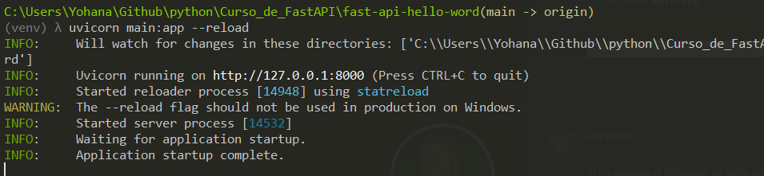

Nos dirigimos al servidor y a continuación observamos lo que nos retorna la ruta que estamos consultando.

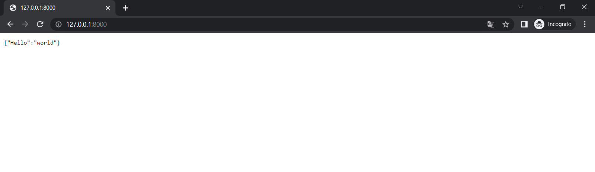

#### Documentación interactiva de una API

FastAPI también está parado sobre los hombros de OpenAPI, el cual es un conjunto de reglas que permite definir cómo describir, crear y visualizar APIs. Es un conjunto de reglas que permiten decir que una API está bien definida.
ㅤ
OpenAPI necesita de un software, el cual es **Swagger**, que es un conjunto de softwares que permiten trabajar con APIs. FastAPI funciona sobre un programa de Swagger el cual es Swagger UI, que permite mostrar la API documentada.
ㅤ
Acceder a la documentación interactiva con Swagger UI:

```
{localhost}/docs
http://127.0.0.1:8000/docs
```

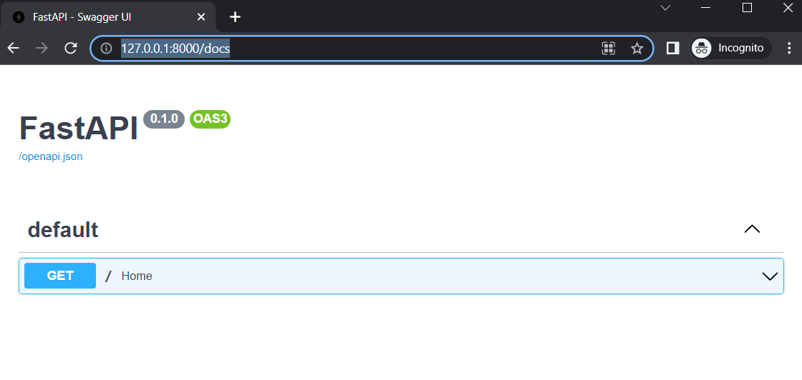

Acceder a la documentación interactiva con Redoc:

```
{localhost}/redoc
http://127.0.0.1:8000/redoc
```

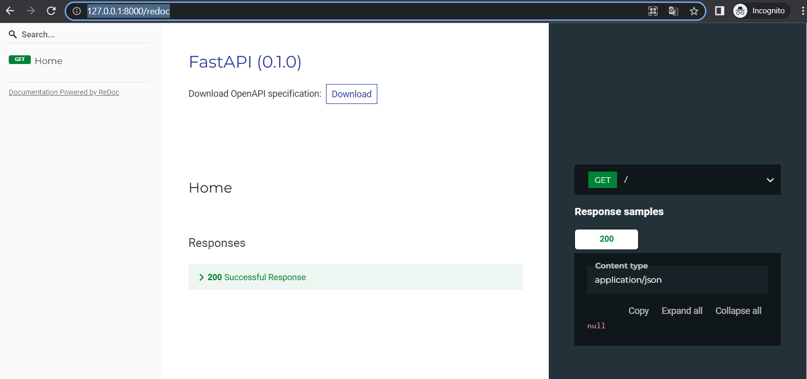

### Path Operations

¿Cómo funcionan las PATH OPERATION?

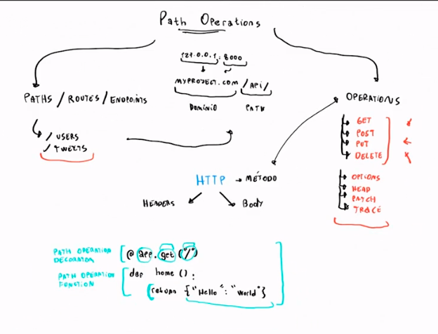

¿Que es un path?
Un path es lo mismo que un route o endpoints y es todo aquello que vaya después de nuestro dominio a la derecha del mismo.

¿Que son las operations?
Un operations es exactamente lo mismo que un método http y tenemos las siguientes más populares: GET, POST, PUT y DELETE

Y otros métodos como OPTIONS, HEAD, PATCH …

### Path Parameters

https://fastapi.tiangolo.com/tutorial/path-params/

Los parámetros de ruta son partes variables de una ruta URL . Por lo general, se utilizan para señalar un recurso específico dentro de una colección, como un usuario identificado por ID. Una URL puede tener varios parámetros de ruta.

```python
from fastapi import FastAPI

app = FastAPI()


@app.get("/items/{item_id}")
async def read_item(item_id):
    return {"item_id": item_id}
```

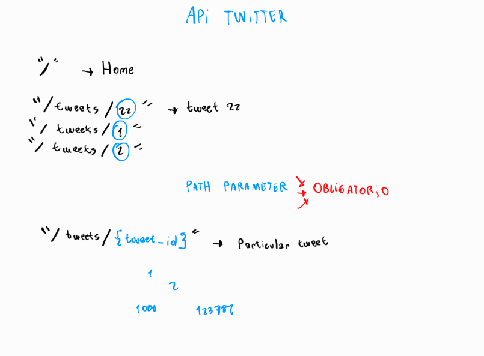

### Query Parameters

https://fastapi.tiangolo.com/tutorial/query-params/

Query parameters: son un conjunto definido de parámetros adjuntos al final de una URL . Son extensiones de la URL que se utilizan para ayudar a definir contenido o acciones específicos en función de los datos que se transmiten.

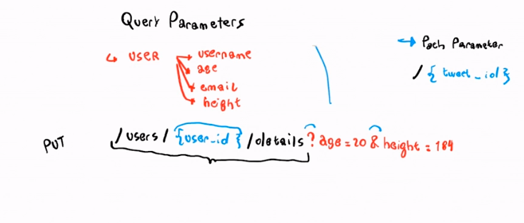

### Request Body y Response Body

Documentacion: https://fastapi.tiangolo.com/tutorial/body/

Un Request Body son datos enviados por el cliente a su API.

Un Response Body son los datos que su API envía al cliente.

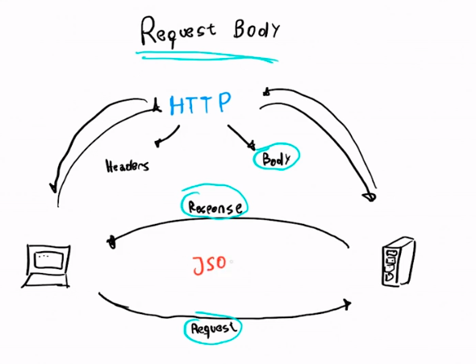

### Models

Documentacion Oficial: https://fastapi.tiangolo.com/tutorial/sql-databases/

Un modelo es la representacion de una entidad en codigo, al menos de una manera descriptiva.

¿Como luce un modelo dentro de FastAPI?

Modelo pydantic para validar datos:

```python
from typing import List, Optional

from pydantic import BaseModel


class ItemBase(BaseModel):
    title: str
    description: Optional[str] = None


class ItemCreate(ItemBase):
    pass


class Item(ItemBase):
    id: int
    owner_id: int

    class Config:
        orm_mode = True


class UserBase(BaseModel):
    email: str


class UserCreate(UserBase):
    password: str


class User(UserBase):
    id: int
    is_active: bool
    items: List[Item] = []

    class Config:
        orm_mode = True
```

Un modelo para mapear los datos a la base de datos (ORM, SQLalchemy)

```python
from sqlalchemy import Boolean, Column, ForeignKey, Integer, String
from sqlalchemy.orm import relationship

from .database import Base


class User(Base):
    __tablename__ = "users"

    id = Column(Integer, primary_key=True, index=True)
    email = Column(String, unique=True, index=True)
    hashed_password = Column(String)
    is_active = Column(Boolean, default=True)

    items = relationship("Item", back_populates="owner")


class Item(Base):
    __tablename__ = "items"

    id = Column(Integer, primary_key=True, index=True)
    title = Column(String, index=True)
    description = Column(String, index=True)
    owner_id = Column(Integer, ForeignKey("users.id"))

    owner = relationship("User", back_populates="items")
```

### Validaciones: Query Parameters

Nota: La persona no nos puede enviar algo que tengo menos de un caracter y mas de 50 caracteres

```python
#Python
from typing import Optional

#FastAPI
from fastapi import FastAPI
from fastapi import Body, Query

app = FastAPI()

@app.get("/person/detail")
def show_person(
    name: Optional[str] = Query(None, min_length=1, max_length=50),
    age: str = Query(...)
): 
    return {name: age}
```

### Validaciones: explorando más parameters

**validar string**
- max-length: Define cantidad maxima de caracteres
- min-length: Define cantidad minima de caracteres
- regex: expresiones regulares

**validar numeros**
- ge (Greater or equal than): permite indicar y saber si este numero es mayor o igual a otro numero >= 
- le (less or equal then): permite saber si un numero es mayor o igual a cero <=
- gt (Greater than): mayor a que la edad sea mayor a 20 >
- lt (less): menor a <

**Paramentros para documentar mejor nuestra documentación**
- title: Colocar titulo
- description: colocar descripción

### Validaciones: Path Parameters

```python
#Pydantic
from pydantic import BaseModel

#FastAPI
from fastapi import FastAPI
from fastapi import Path

app = FastAPI()

# Validaciones: Path Parameters

@app.get("/person/detail/{person_id}")
def show_person(
    person_id: int = Path(..., gt=0)
): 
    return {person_id: "It exists!"}
```

### Tipos de datos especiales

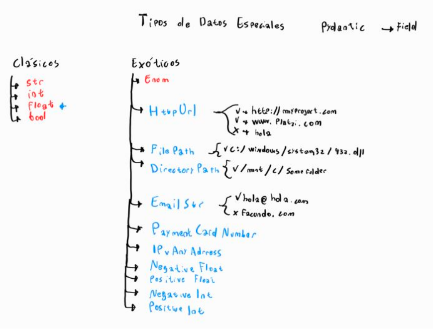

**Documentación de validaciones**

> https://pydantic-docs.helpmanual.io/usage/types/#pydantic-types

### Response Model

Es un atributo de nuestra Path Operation particularmente este atributo se coloca dentro de nuestra Path Operation Decoration

```python
@app.post("/person/new", response_model=PersonOut)
def create_person(person : Person = Body(...)):
    return person
```

Nota: Recibimos los datos del modelo de Person donde recibimos la contraseña pero al momento de enviar
retornamos los datos que estan en PersonOut

```python
class Person(BaseModel):

    first_name: str = Field(
        ..., 
        min_length=1,
        max_length=50
        )
    last_name: str = Field(
        ..., 
        min_length=1,
        max_length=50
        )
    age: int = Field(
        ...,
        gt=0,
        le=115
    )
    email: EmailStr = Field(
        ...
        ) 
    hair_color: Optional[HairColor] = Field(default=None)
    is_married: Optional[bool] = Field(default=None)
    password: str = Field(..., min_length=8)
```

**Datos que se retornan** donde solo retornamos lo datos a enviar

```python
class PersonOut(BaseModel):
    
    first_name: str = Field(
        ..., 
        min_length=1,
        max_length=50
        )
    last_name: str = Field(
        ..., 
        min_length=1,
        max_length=50
        )
    age: int = Field(
        ...,
        gt=0,
        le=115
    )
    email: EmailStr = Field(
        ...
        ) 
    hair_color: Optional[HairColor] = Field(default=None)
    is_married: Optional[bool] = Field(default=None)
```

### Mejorando la calidad del código: eliminando líneas duplicadas

Como podemos ver tenemos dos modelos exactamente igual salvo por una linea de código para esto y conociendo
haciendo mejores prácticas vamos a aplicar herencia.

**creamos una clase llamada PersonBase**

```python
class PersonBase(BaseModel):
    first_name: str = Field(
        ..., 
        min_length=1,
        max_length=50
        )
    last_name: str = Field(
        ..., 
        min_length=1,
        max_length=50
        )
    age: int = Field(
        ...,
        gt=0,
        le=115
    )
    email: EmailStr = Field(
        ...
        ) 
    hair_color: Optional[HairColor] = Field(default=None)
    is_married: Optional[bool] = Field(default=None)
```

**Person y PersonOut van a heredar de PersonBase**

```python
class Person(PersonBase):
    password: str = Field(..., min_length=8)
```

```python
class PersonOut(PersonBase):
    pass
```

### Status Code personalizados

Los status code o codigos de estado son respuestas http los cuales indican el el estado de finalizacion de una solicitud especifica:

- Respuestas informativas (100-199)
- Respuestas Satisfactorias (200-299)
- Redirecciones (300-399)
- Errores de los clientes (400-499)
- Errores de los servidores (500-599)

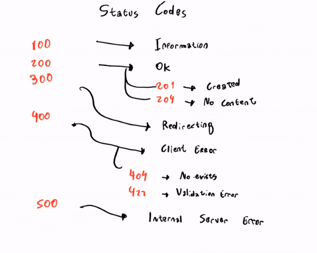

```python
from fastapi import status

@app.get(
    path="/person/detail/{person_id}",
    status_code=status.HTTP_200_OK
    )
def show_person(
    person_id: int = Path(
        ..., 
        gt=0,
        example=123,
        title="Person Id",
        description="This is the person identifier. It´s required")
):
    return {person_id: "It exists!"}
```

### Formularios

Para trabajar con formularios necesitamos de una libreria 

```
pip install python-multipart

```

### Cookie y Header Parameters

**Header:** es una parte de una respuesta o petición HTTP
**cookie:** Pieza de codigo que un servidor mete en tu computadora cuando estamos navegando en la web.

```python
@app.post(
    path="/contact",
    status_code=status.HTTP_200_OK
)
def contact(
    first_name: str = Form(
        ...,
        max_length=20,
        min_length=1
    ),
    last_name: str = Form(
        ...,
        max_length=20,
        min_length=1
    ),
    email: EmailStr = Form(...),
    message: str = Form(
        ...,
        min_length=20
    ),
    user_agent: Optional[str] = Header(default=None),
    ads: Optional[str] = Cookie(default=None)
):
    return user_agents
```

### Archivos

Imaginemos que queremos subir un video, esto se hace mediante archivos.

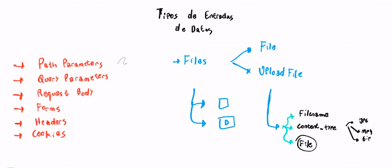

```python
# Files

@app.post(
    path="/post-image"
)
def post_image(
    image: UploadFile = File(...)
):
    return {
        "Filename": image.filename,
        "Format": image.content_type,
        "Size(kb)": round(len(image.file.read())/1024, ndigits=2)
    }
```

### HTTPException

```python
@app.get(
    path="/person/detail/{person_id}",
    status_code=status.HTTP_200_OK
    )
def show_person(
    person_id: int = Path(
        ..., 
        gt=0,
        example=123,
        title="Person Id",
        description="This is the person identifier. It´s required")
):
    if person_id not in persons:
        raise HTTPException(
            status_code=status.HTTP_404_NOT_FOUND,
            detail="¡This person doesn´t exist!"
        )

    return {person_id: "It exists!"}
```

### Comenzando a ordenar nuestra documentación: etiquetas

Es suprepamente importante mantener el orden de nuestras Http routes

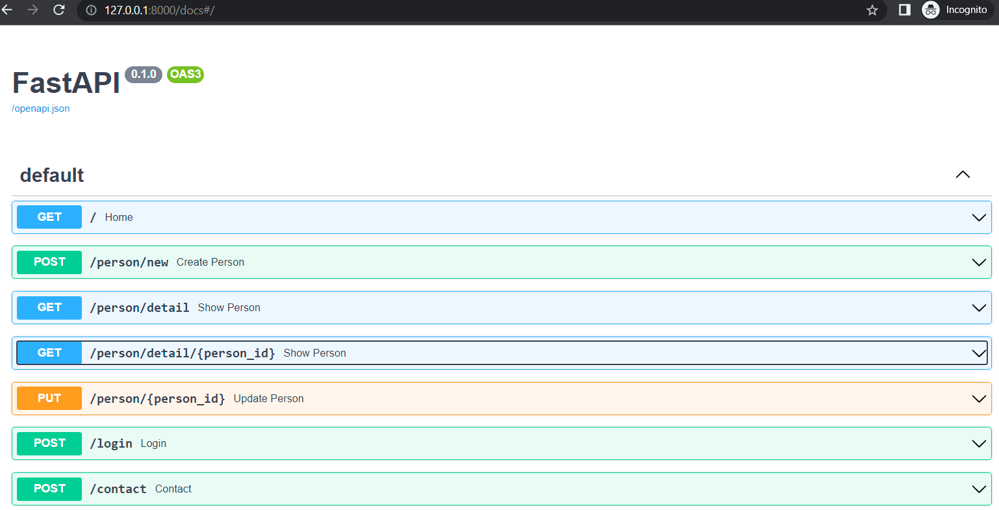

Las podemos clasificar por una funcionalidad en particular y esto se realiza a traves de tags:

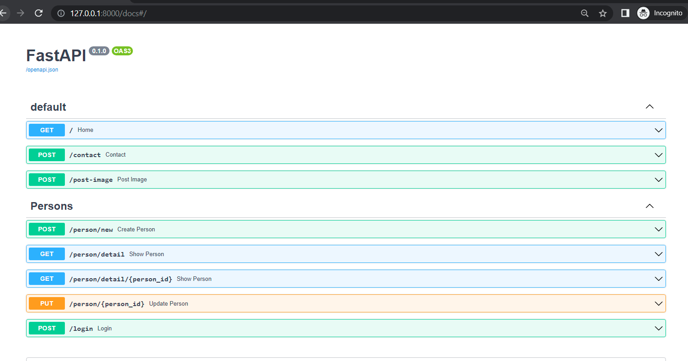

Los tags nos permite mantener cierto orden en nuestra documentación.

```python
# Request and Response Body
@app.post(
    path="/person/new", 
    response_model=PersonOut,
    status_code=status.HTTP_201_CREATED,
    tags=["Persons"]
    )
def create_person(person : Person = Body(...)):
    return person
```

### Nombre y descripción de una path operation

Los aspectos para hacer el **docstring** de las path operations:

- Título
- Descripción
- Parámetros
- Resultado

```python
@app.post(
    path="/person/new", 
    response_model=PersonOut,
    status_code=status.HTTP_201_CREATED,
    tags=["Persons"],
    summary="Create Person in the app"
    )
def create_person(person : Person = Body(...)):
    """
    Create Person
    
    This path operation creates a person in the app and save the informmation in the database

    Parameters:
    - Request body parameters:
        - **person: Person** -> A person model with first name, last name, age, hair, color and marital status

    Returns a person model with first name, last name, age, hair, color and marital status
    """
    return person
```

La documentación de nuestro código es muy importante ya que ayuda a entender con mayor facilidad las operaciones que se realizaran en este proceso 

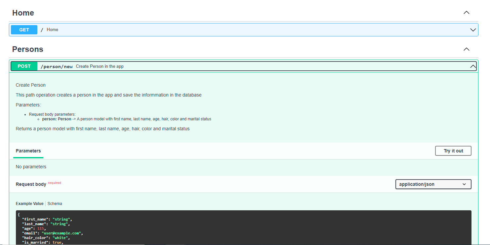

### Deprecar una path operation

Deprecar una pieza de código sucede cuando:

- Se encuentra un mejor método mas eficiente para resolver un problema que nosotros ya tenemos. Lo que hacemos no es eliminar dicho método si no la dejamos sin efecto. Para aprovechar el código posteriormente si lo requerimos nuevamente.
- Una funcionalidad diferente de nuestro código a la que ya tenemos definidos.
- Cuando se esta realizando una refactorización profunda del código, debido a que no tiene las mejores practicas, se define  deprecar las path operation que se tienen por otras nuevas y se reemplazan. Nota: Siempre es mejor mantener el código que modificarlo desde cero.

```python
@app.get(
    path="/person/detail",
    status_code=status.HTTP_200_OK,
    tags=["Persons"],
    deprecated=True
    )
def show_person(
    name: Optional[str] = Query(
        None, 
        min_length=1,
        max_length=50,
        title="Person Name",
        description="This is the person name. It´s between a and 50 characters",
        example="Rocio"
        ), 
    age: str = Query(
        ...,
        title="Person Age",
        description="This is the person age. It´s required",
        example=25
        ) 
):
```

### Proyecto Twitter

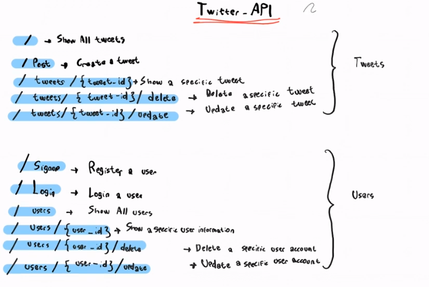

### Modelos: User

Nota 

UUID: es una clase especial de python que nos permite colocar un identificador unico a los usuarios.

Para usarlo importamos la clase:

```python
from uuid import UUID
```

Field: son campos que nos permiten validar con el Fiel(...) validamos la obligatoriedad del campo

```python
user_id: UUID = Field(...)
```

```python
# Models
class UserBase(BaseModel):
    user_id: UUID = Field(...)
    email: EmailStr = Field(...)


class UserLogin(UserBase):
    password: str = Field(
        ...,
        min_length=8
    )


class User(UserBase):
    first_name: str = Field(
        ...,
        min_length=1,
        max_length=50
    )
    last_name: str = Field(
        ...,
        min_length=1,
        max_length=50
    )
    birth_date: Optional[date] = Field(default=None)

class Tweet(BaseModel):
    pass
```

### Modelos: Tweet

```python
class Tweet(BaseModel):
    tweet_id: UUID = Field(...)
    content: str = Field(...,
    min_length=1, 
    max_length=256
    )
    created_at: datetime = Field(
        default=datetime.now()
    )
    update_at: Optional[date] = Field( default=None)
    by: User = Field(...)
```

### Esqueleto de las Path Operations: Users

```python
@app.post(
    path="/signup",
    response_model= User,
    status_code=status.HTTP_201_CREATED,
    summary="Register a User",
    tags=["Users"]   
)
def signup():
    pass

@app.post(
    path="/login",
    response_model= User,
    status_code=status.HTTP_200_OK,
    summary="login a user",
    tags=["Users"]   
)
def login():
    pass

@app.get(
    path="/users",
    response_model= List[User],
    status_code=status.HTTP_200_OK,
    summary="Show all users",
    tags=["Users"]   
)
def show_all_users():
    pass

@app.get(
    path="/users/{user_id}",
    response_model= User,
    status_code=status.HTTP_200_OK,
    summary="Show a User",
    tags=["Users"]   
)
def show_a_user():
    pass

@app.delete(
    path="/users/{user_id}/delete",
    response_model= User,
    status_code=status.HTTP_200_OK,
    summary="Delete a User",
    tags=["Users"]   
)
def delete_a_user():
    pass

@app.put(
    path="/users/{user_id}/update",
    response_model= User,
    status_code=status.HTTP_200_OK,
    summary="Update a User",
    tags=["Users"]   
)
def update_a_user():
    pass
```

### Esqueleto de las Path Operations: Tweets

```python
### Show all tweets
@app.get(
    path="/",
    response_model= List[Tweet],
    status_code=status.HTTP_200_OK,
    summary="Show all tweets",
    tags=["Tweets"]   
)
def show_all_tweets():
    pass

### Post a tweet
@app.post(
    path="/post",
    response_model= Tweet,
    status_code=status.HTTP_201_CREATED,
    summary="Post a tweet",
    tags=["Tweets"]   
)
def post():
    pass

### Show a tweet
@app.get(
    path="/tweets/{tweet_id}",
    response_model= Tweet,
    status_code=status.HTTP_200_OK,
    summary="Show a specific tweet",
    tags=["Tweets"]   
)
def show_a_tweet():
    pass

### Delete a tweet
@app.delete(
    path="/tweets/{tweet_id}/delete",
    response_model= Tweet,
    status_code=status.HTTP_200_OK,
    summary="delete a specific tweet",
    tags=["Tweets"]   
)
def delete_a_tweet():
    pass

### update a tweet
@app.put(
    path="/tweets/{tweet_id}/update",
    response_model= Tweet,
    status_code=status.HTTP_200_OK,
    summary="update a specific tweet",
    tags=["Tweets"]   
)
def update_a_tweet():
    pass
```