# Curso Profesional d python

### Introducción
- [Introducción](#Introducción)
    - [¿Qué necesitas saber para tomar el curso?](#Qué_necesitas_saber_para_tomar_el_curso)
    - [¿Cómo funciona Python?](#Cómo_funciona_Python)
    - [¿Comó organizar las carpetas de tus proyectos?](#comó_organizar_las_carpetas_de_tus_proyectos)
- [Static Typing](#Static_typing)
    - [¿Qué son los tipados?](#Qué_son_los_tipados)
    - [Tipado est√°tico en python](#Arrays_de_dos_dimensiones)
    - [Practicando el tipado est√°tico](#Arrays_de_dos_dimensiones)
- [Conceptos avanzados de funciones](#Linked_lists)
    - [Scope: alcance de las variables](#Nodos_y_singly_linked_list)
    - [Closures](#Crear_nodos)
    - [Programando closures](#Crear_singly_linked_lists)
    - [Decoradores](#Operaciones_en_single_linked_structures)
    - [Programando decoradores](#Operaciones_a_detalle)
- [Estructura de datos avanzadas](#Stacks)
    - [Iteradores](#Que_son_stacks)
    - [La sucesión de Fibonacci](#crear_stack)
    - [Generadores](#Que_son_stacks)
    - [Mejorando nuestra sucesión de Fibonacci](#crear_stack)
    - [sets](#Que_son_stacks)
    - [Operaciones con sets](#crear_stack)
    - [Eliminando los repetidos de una lista](#Que_son_stacks)
- [Bonus](#Queues)
    - [Manejo de fechas](#Que_son_los_queues)
    - [Time zones](#Queue_basada_en_listas)

# Introducción

### ¿Qué necesitas saber para tomar el curso?

- Curso Basico de python
- Git / Github
- POO

### ¿Cómo funciona Python?

**Compilado vs Interpretado**

C++ es un lenguaje **compilado** por lo tanto lo que sucede en el motor de este lenguaje de programación es que el codigo se transforma mediante el compilador que es una herramienta que posee el lenguaje a código maquina es decir a 0 y 1 esto hace que la computadora pueda ejecutar el programa.

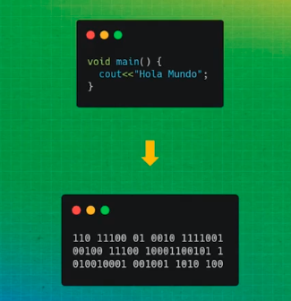

python por el contrario es un lenguaje **interpretado** al realizarse la conversión nosotros no pasamos a codigo máquina si no que pasamos a un estado intermedio con instrucciones que son legibles denominado byte code.

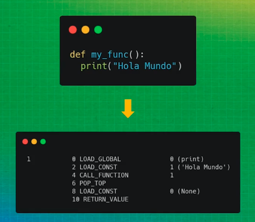

 El byte code es un lenguaje especial que es de mas bajo nivel que python que puede ser leido por un **interprete** la caracteristica especial es que este lenguaje es leido por una maquina virtual


La maquina virtual puede ser ejecutado en diferentes sistemas operativos.

**Definiciones**

**Garbage collector:** Tomar los objetos y las variables que no estan en uso y los elimina.

**__pycache__:** cuando se crea la carpeta __pycache__ lo que esta adentro de esta carpeta es byte code es ese codigo intermedio que crea python al ser un lenguaje interpretado para que pueda ser leido por la maquina virtual.

### ¿Comó organizar las carpetas de tus proyectos?

Para comprender como organizar los proyectos de python es importante tener en cuenta dos definiciones: paquetes y módulos

**Módulo:** un módulo es cualquier archivo de python. Generalmente, contiene código que puedes reutilizar.

**Paquete:** Un paquete es una carpeta que contiene módulos siempre  posee el archivo __init__.py

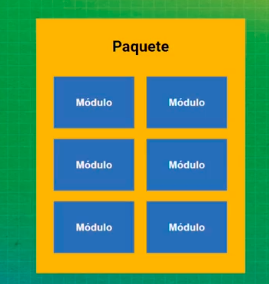

Ejemplo de organizar la estructura de un proyecto en python.

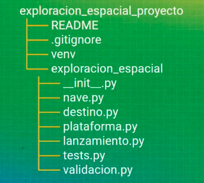

# Static Typing

### ¿Qué son los tipados?

Los tipados es una clasificación de los lenguajes de programación, tenemos cuatro tipos:

- Est√°tico
- Din√°mico
- Débil
- Fuerte

El tipado del lenguaje depende de cómo trata a los tipos de datos.

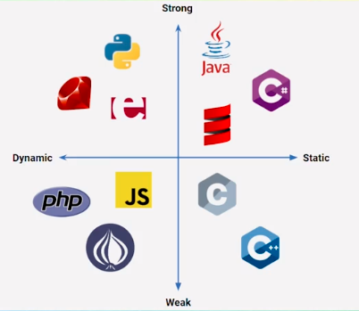

**est√°tico**

El tipado estático es el que levanta un error en el tiempo de compilación, ejemplo en JAVA:

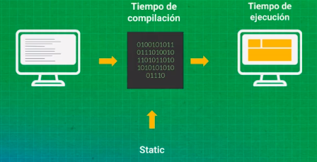

```java
String str = "Hello" // Variable tipo String
str = 5 // ERROR: no se puede convertir un tipo de dato en otro de esta forma.
```

**din√°mico**

El tipado dinámico levantan el error en tiempo de ejecución, ejemplo en Python:

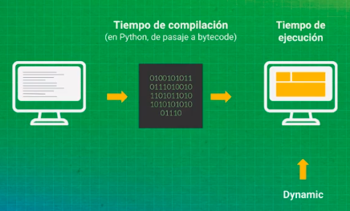

```python
str = "Hello" # Variable tipo String
str = 5 # La variable ahora es de tipo Entero, no hay error

## TIPADO FUERTE
x = 1
y = "2"
z = x + y # ERROR: no podemos hacer estas operaciones con tipos de datos distintos entre sí
```
**débil**

El tipado débil es el que hace un cambio en un tipo de dato para poder operar con el, como lo hace JavaScript y PHP.

```js
x = 1
y = "2"
z = x + y //12
```

```php
<?php
$str = 5 + "5" // equals 10 because "5" is implicity casted to 5 as an integer
// PHP is weakly typed, this is a very forgiving languaje
```

üêç Python es un lenguaje de tipado üëæ Din√°mico y üí™ Fuerte.

### Practicando el tipado est√°tico

Como hacer para que el tipado de python de tipo din√°mico sea est√°tico **Static Typing**

 **Static Typing**

**Asignando el tipo a la variable**

 ```python
 a: int = 5
 print(a) // 5

 b: str = 'Hola'
 print(b) // Hola

 c: bool = True
 print(c) // True
 ```

 **Asignando el tipo a las funciones**

 ```python
def suma(a: int, b:int )->int:
    return a + b

print(suma(1,2)) // 3

def suma(a: int, b:int )->int:
    return a + b

print(suma('1','2')) // 12
 ```

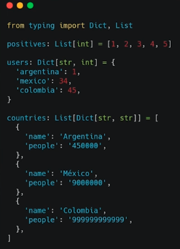

En tipyng tenemos disponible la clase tupla

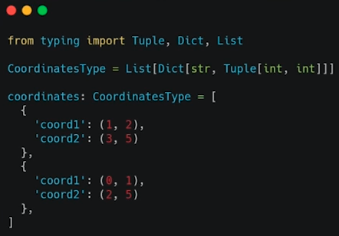

**mypy**

Es modulo especial en python que nos permite mostrar los errores en consola

**Ventaja de usar types**

- Aporta claridad y calidad al código va a ser mucho mas entendible
- Podremos visualizar errores antes de que el programa se ejecute.

**Crear nuestro entorno virtual**

 ```
py -m venv venv
 ```
**Entrar al entorno virtual**

 ```
 .\venv\Scripts\activate
 (venv) λ pip install mypy
  ```
 **Mejores pr√°cticas usando tipo de variable**

 ```python
  def is_palindromo(String: str)->bool:
    String = String.replace(' ', '').lower()
    return String == String[::-1]

def run():
    print(is_palindromo(1000))


if __name__ == '__main__':
    run()

"""
(venv) λ mypy palindrome.py --check-untyped-defs
palindrome.py:6: error: Argument 1 to "is_palindromo" has incompatible type "int"; expected "str"
Found 1 error in 1 file (checked 1 source file)
"""
 ```
 # Conceptos avanzados de funciones

 ### Scope: alcance de las variables

 Una variable solo está disponible dentro de la región donde fue creada.

**Local Scope**

Es la región que corresponde el ámbito de una función, donde podremos tener una o mas variables, las variables van a ser accesibles únicamente en esta region y no serán visibles para otras regiones

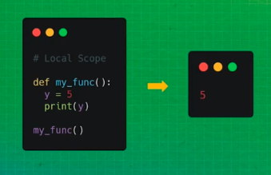

**Global Scope**

Al escribir una o mas variables en esta region, estas podrán ser accesibles desde cualquier parte del código.

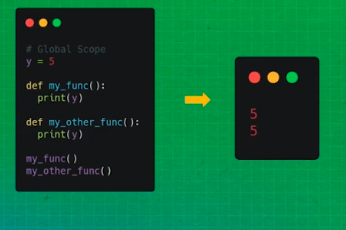

### Closures

Para entender los **clousures** tenemos que entender que son las funciones anidadas.

**Nested functions o (Funciones anidadas):** Son funciones que estan creadas dentro de otras funciones

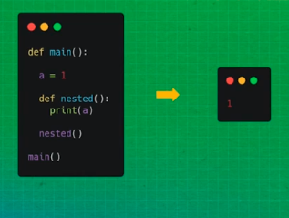

un **clousure** es una variable que este en un scope superior y es recordada por una función que esta en un scope inferior. Aunque esta función sea eliminada anteriormente

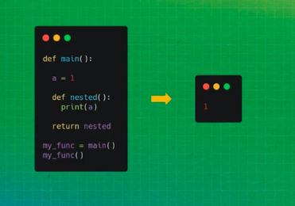

```python
def main():
    
    a = 1

    def nested():
        print(a)

    return nested
    
my_func = main()
my_func()

del(main)

my_func()

```

**Reglas para encontrar un clousure**
- Debemos tener una nested función.
- La nested function debe referenciar un valor de un scope superior.
- La función debe retornarla también.

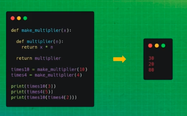

### Decoradores

Un **decorador** es un clousure su definión: Función que recibe como parámetro otra función, le añade cosas, y retorna una función diferente.

```python
def decorador(func):
    def envoltura():
        print('Esto se añade a mi función original')
        func()
    return envoltura

def saludo():
    print('¬°Hola!')

saludo();
# output
# ¬°Hola!

saludo = decorador(saludo)
saludo()
#output
#Esto se añade a mi función original
# ¬°Hola!
```

Esto se puede simplificar de la siguiente manera:

```python
def decorador(func):
    def envoltura():
        print('Esto se añade a mi función original')
        func()
    return envoltura

@decorador
def saludo():
    print('¬°Hola!')

saludo()
#output
#Esto se añade a mi función original
#¬°Hola!
```

# Estructura de datos avanzadas

### Iteradores

> Una estructura de datos para guardar datos infinitos.

Antes de entender qué son los iteradores, primero debemos entender a los iterables.

Son todos aquellos objetos que podemos recorrer en un ciclo. Son aquellas estructuras de datos divisibles en elementos √∫nicos que yo puedo recorrer en un ciclo.

Pero en Python las cosas no son así. Los iterables se convierten en iteradores.

Ejemplo:

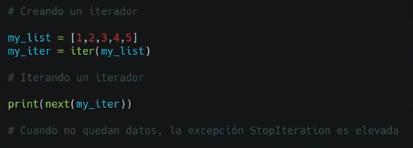

**¿Comó construir un iterador?**

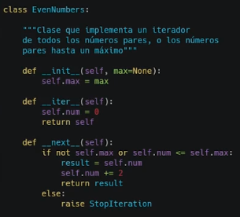

**ventajas de usar iteradores**

- Un iterador nos ahorra recursos
- Ocupan poca memoria

El ciclo “for” dentro de Python, no existe. Es un while con StopIteration. 🤯🤯🤯
