# Esctructura de Datos Lineales con Python

### Indice
- [Introducción a las estructuras de datos](#Introducción_a_las_estructuras_de_datos)
    - [Python como base de programación](#Python_como_base_de_programación)
    - [Elementos de la programación en Python](#Elementos_de_la_programación_en_Python)
    - [Tipos de colecciones](#Tipos_de_colecciones)
    - [Operaciones esenciales con colecciones](#Operaciones_esenciales_con_colecciones)
    - [Colecciones incorporadas en Python](#Colecciones_incorporadas_en_Python)
- [Arrays](#Arrays)
    - [Arrays](#Arrays)
    - [Arrays de dos dimensiones](#Arrays_de_dos_dimensiones)
- [Linked lists](#Linked_lists)
    - [Nodos y singly linked list](#Nodos_y_singly_linked_list)
    - [Crear nodos](#Crear_nodos)
    - [Crear singly linked lists](#Crear_singly_linked_lists)
    - [Operaciones en single linked structures](#Operaciones_en_single_linked_structures)
    - [Operaciones a detalle](#Operaciones_a_detalle)
    - [Circular linked list](#Circular_linked_list)
- [Stacks](#Stacks)
    - [Qué son stacks?](#Que_son_stacks)
    - [crear stack](#crear_stack)
- [Queues](#Queues)
    - [Qué son los queues?](#Que_son_los_queues)
    - [Queue basada en listas](#Queue_basada_en_listas)
    - [Queue basada en dos stacks](#Queue_basada_en_dos_stacks)
    - [Queue basada en nodos](#Queue_basada_en_nodos)
    - [Reto: simulador de playlists musical](#simulador_de_playlists_musical)
- [Próximos pasos](#Próximos_pasos)
    - [Más allá de las estructuras lineales](#Más_allá_de_las_estructuras_lineales)

# Introducción a las estructuras de datos

### Python como base de programación

**De aprendizaje**

- Entender el concepto e importancia de estructuras de datos
- Comprender el comportamiento, uso e interacción de estructuras de datos con python
- Poner en práctica lo aprendido.

**Por qué python**

python ayuda bastante a aplicar estos conceptos, algunos beneficios:

- sintansix clara y simple
- Semántica segura
- Escalable
- Interactivo
- Propósito general
- Gratis y popular

### Elementos de la programación en Python

**Elementos léxicos**
- if, while, def, etc


**Convenciones**
- variables
- constante
- nombre_funcion
- nombreClase


**A tomar en cuenta**
- Sintasix
- Literales
- Operadores
- Import
- Condicionales
- Loops

**Estructuras propias**

```python
[]
# An empty list
["hello!!"]
# A list of one string
["hello!!", "oops"]
# A listof two strings
["hello!!", "oops", 10]
# A listof two strings and an int
["hello!!", ["oops", 10]]
# A list with a nested list
```
**Operaciones esenciales**

**Estructuras propias**
- Listas
- Tuplas
- Conjuntos o sets
- Diccionarios

```python
items_lists = []
# items_lists is []
items_lists.append(34)
# items_lists is [34]
items_lists.append(22)
# items_lists is [34,22]
items_lists.sort()
# items_lists is [22, 34]
items_lists.pop()
# Returns 34; items_lists is [22]
items_lists.insert(1, 34)
# Returns 34; items_lists is [22, 34]
items_lists.insert(1, 55)
# Returns 34; items_lists is [22, 55, 34]
items_lists.pop(1)
# Returns 55; items_lists is [22, 34]
items_lists.remove(22)
#items_lists is [34]
items_lists.remove(55)
#raises valueError
```

**Funciones**

- Declaración y llamada
- Recursivas
- Anidadas
- High order functions
- Lambdas

**Además**

- Manejo de excepciones y errores
- Manipulación de archivos

### Tipos de colecciones

**¿Qué es una colección?**: Grupo de cero o más elementos que pueden tratarse como unidad conceptual

**Tipos de colecciones**

- Dinámicas: Aquellas que pueden crecer o disminuir su tamaño
- Inmutables: Aquellas que no van a cambiar

**Lineales**

- Ordenadas por posición
- Solo el primer elemento NO tiene predecesor.


**Ejemplo de colecciones lineales**

- Fila en el supermercado
- Pila de platos
- Checklist

**Jerárquicas**

- Ordenadas como un árbol invertido.
- Solo el primer elemento NO tiene predecesor.
- Padres e hijos


**Ejemplo de colecciones Jerárquicas**

- Sistemas de directorios.
- Índices de libros

**Grafos**

- Cada dato puede tener varios predecesores y sucesores.
- Estos de llaman "vecinos"


**Ejemplo**


**Desordenadas**

- No tienen orden particular.
- No hay predecesores o sucesores.


**Ejemplo**

- Una bolsa de canicas
- Premios de loterias

**Ordenadas**

- Impone un orden con una regla. item(i) <= item (i+1)

**Ejemplo**
- catalogo de pinturas
- Directorios telefonicos

### Operaciones esenciales con colecciones

**Operaciones**

- Tamaño
- Pertenencia
- Recorrido
- String
- Igualdad
- Concatenación
- Conversión de tipo
- Insertar
- Remover
- Reemplazar
- Acceder

```python
[]
# An empty list
["hello!!"]
# A list of one string
["hello!!", "oops"]
# A listof two strings
["hello!!", "oops", 10]
# A listof two strings and an int
["hello!!", ["oops", 10]]
# A list with a nested list
```
**Operaciones esenciales**

**Estructuras propias**
- Listas
- Tuplas
- Conjuntos o sets
- Diccionarios

```python
def pyramid_sum(lower, upper, margin=0):
    blanks = " " * margin
    print(blanks, lower, upper)
    if lower > upper:
        print(blanks, 0)
        return 0
    else:
        result = lower + pyramid_sum(lower + 1, upper, margin + 4)
        print(blanks, result)
        return result

(env) λ py pyramid_sum.py
 1 4
     2 4
         3 4
             4 4
                 5 4
                 0
             4
         7
     9
 10

```

### Colecciones incorporadas en Python

**Listas**
- Propósito general
- Estructura más utilizada.
- Tamaño dinámico
- De tipo secuencial
- Ordenable.

**Tuplas**
- Inmutables (No se pueden añadir o cambiar)
- Útiles para datos constantes.
- Más rápidas que las listas
- Tipo secuencial

```python
tuple1 = ()
tuple2 = (1274, 1275, 1276)
tuple3 = 'mulan','pucca', 'percy',

print(tuple1)
print(tuple2)
print(tuple3)

>>> ()
>>> (1274, 1275, 1276)
>>> ('mulan','pucca', 'percy')
```

**Conjuntos/Sets**

- Almacenen objetos no-duplicados
- De acceso rápido
- Aceptan operaciones lógicas
- Son desordenados.

**Ejemplo**
- Receta de cocina

```python
set1 = {3, 5, 9, 3, 9}
set2 = set()
numbers = [1, 2, 3, 4, 5, 6, 1, 2]
set3 = set(numbers)

print(set1)
print(set2)
print(set3)

>>> { 9, 3, 5}
>>> set()
>>> {1, 2, 3, 4, 5, 6}
```

**Diccionarios/Dictionaries**

- Pares de llave / valor
- Arrays asociativos (hash maps)
- Son desordenados

```python
cats1 = {
    'mulan': 2,
    'pucca': 1.2,
    'percy': 4,
}

cats2 = dict([('mulan', 2), ('pucca', 1.2), ('percy', 4)])
cats3 = dict(mulan=2, pucca=1.2, percy=4)

print(cats1)
print(cats2)
print(cats3)

>>> { 'mulan': 2, 'pucca': 1.2}
```

**¿En qué casos usarías cada estrutura?**

Listas: guardar informacion 
Tuplas : guardar paises
Conjuntos: juego loteria
Diccionarios: guradar información de un formulario

**¿Qué tipo de información guardarías?**
Listas

```python 
set1 = {'nombre', 23}
```

Tuplas:

```python 
tuple3 = 'Colombia','México', '',
```
Conjuntos:

```python 
set1 = {3, 5, 9, 3, 9}
```

Diccionarios: 

```python 
cats1 = {
    'nombre': 'Juan valdez',
    'edad': 94,
    'ciudad': 'México,
}
```

# Arrays

### Arrays

Estructura de dato lineal

**¿Qué es una estructura de datos?**

Representación interna de una colección de información.

**Conceptos clave**
- **Elemento:** valor almacenado en las posiciones del array
- **Índice:** referencia a la posición del elemento

Esta es la memoria en la computadora, de forma conceptual se observaria de esta manera

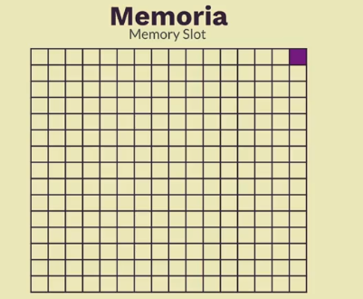

Podemos ocupar una o multiples casillas, aqui podemos ver como se guardaria esta variable en memoria

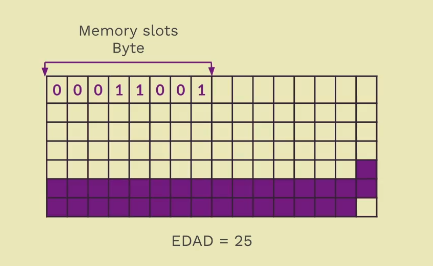

conforme a como vamos agregando información esto se pone de forma consecutiva.

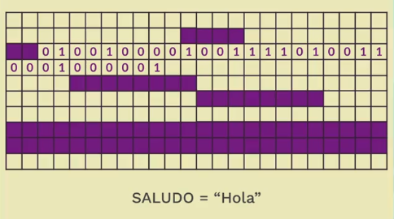

Los **arrays** van a guardar información de forma consecutiva, y tiene ciertas restricciones como al momento de guardar la información yo no voy a poder guardar mas de la que me permite el array, en cambio una **lista** en python se puede guardar de manera dinamica y la información no va a ser consecutiva si no que va a estar dispersa en la memoria.

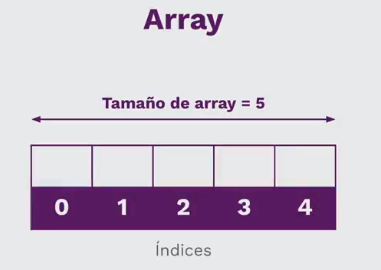

- el array tiene una capacidad y es el número de elementos que puede almacenar su tamaño.
- hay distintos tipos de arrays

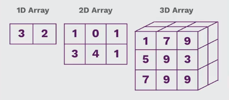

**se recomienda no trabajar en estructura de datos de mas de dos dimensiones**

**¿Los arrays son listas?**

Respuesta si los arrays son un tipo de lista pero las listas no son arrays

**Los arrays son restrictivos**
No pueden:
- Agregar posiciones
- Remover posiciones
- Modificar su Tamaño
- Su capacidad se define al crearse.

**Donde se usan**
- Un videjuego con sprites de 100x100 px.
- Opciones en un menú

**crear nuestro propio array**

Metódos:
- Crearse
- Longitud
- Representación de string
- Pertenencia
- índice
- Reemplazo

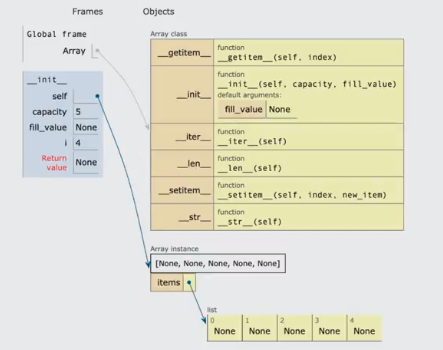

> ver codigo adjunto array.py

### Arrays de dos dimensiones

**Otros nombres**
- Bi-dimensional array
- Two-dimensional array
- Grid
- Rejilla
- Malla
- Tabla

**Estructura**

Tenemos filas y columnas y dentro de estas valores

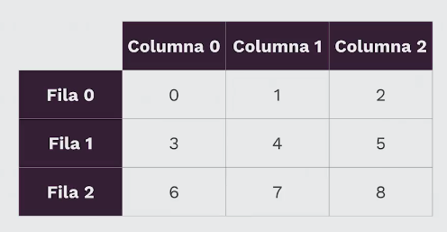

> archivo adjunto grid.py

# Linked lists

### Nodos y singly linked list

Tambien conocidas como **linked structures**
- Consiste de nodos conectados a otros
- Los más comunes son sencillos o dobles
- No se acceden por indices, si no por recorrido

**Conceptos claves**
- **Data:** valor almacenado en nodos.
- **Next:** referencia al siguiente nodo.
- **Previous:** referencia al nodo anterior.
- **Head:** referencia al primer nodo.
- **Tail:** referencia al último nodo.

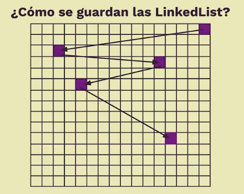

Los datos en los nodos estan repartidos en la memoria no son contiguos como los arrays entonces para poder hacer referencia a otro dato utilizamos los nodos que son otros datos que van a estar almacenados en otro espacio en memoria y el siguiente en otro diferente que no es continuo esto nos da la ventaja de que podemos acceder a los datos saltando en los espacios de memoria de una forma muchisimo mas agil que tener que usar una lista que deba de buscarlos.

**Implementación**

- Implementar otras estructuras
- Optimización

**Singly Linked Structure**

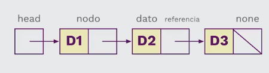

En una serie de nodos el ultimo nodo nos va a llevar a None

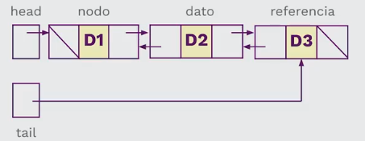

Estos tienen un comportamiento diferente uno nodo puede hacer referencia a otro nodo en la siguiente lista y al anterior de esta forma podemos recorrer la lista en un sentido y en el otro.

**Ejemplo de linked lists**

- Hacer/rehacer operaciones en un editor de texto.
- Historial de un navegador.

### Crear nodos

**Singly linked list con nodos**
- Crear una clase Node
- Referimos valores
- Unimos nodos iterando

```python 
class Node():

    """ En una serie de nodos el ultimo nodo nos va a llevar a None """
    def __init__(self, data, next=None):
        self.data = data
        self.next = next

"""
>>> from node import Node
>>> node1 = None
>>> node2 = Node("A", None)
>>> node3 = Node("B", node2)
>>> node2
<node.Node object at 0x00000216BCE62530>
>>> node2.data
'A'
>>> node2.next
>>> node3.next
<node.Node object at 0x00000216BCE62530>
>>> node3.next.data
>>> node3.next.data
'A'
>>> node1
>>> node1.next
Traceback (most recent call last):
  File "<stdin>", line 1, in <module>
AttributeError: 'NoneType' object has no attribute 'next'
>>> node1 = Node("C", node3)
>>> node1.next.data
'B'
>>> node1.data
'C'
>>> head = None
>>> for count in range(1,5):
...     head = Node(count, head)
...
>>> while head != None:
...     print(head.data)
...     head = head.next
...
4
3
2
1
"""
```
**Entendiendo el codigo**

Creamos tres nodos node1, node2 y node3. Node1 apuntaba a None mientras node2 apuntaba a la dirección en memoria del siguiente nodo al que se conectaba y el tercer nodo tenia un valor y hacia referencia al segundo nodo.

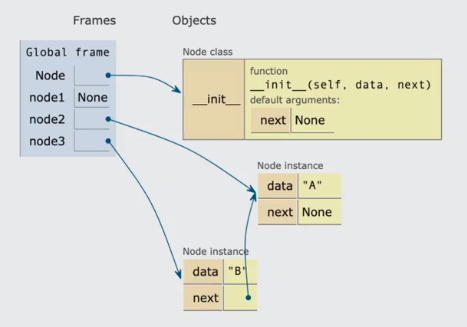

Luego cambiamos las referencias

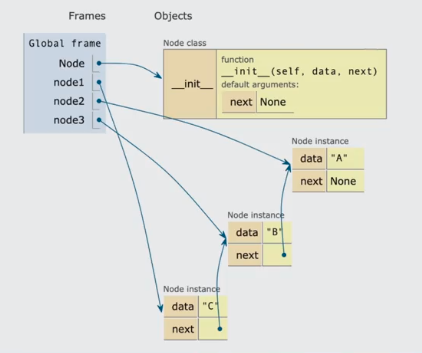

Con el ciclo while realizamos una serie de nodos que hacian referencias unos a otros. a 
su vez estos nodos se conectaban a los otros.

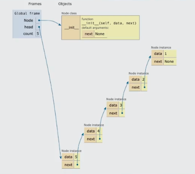

> adjunto codigo node.py

### Crear singly linked lists


