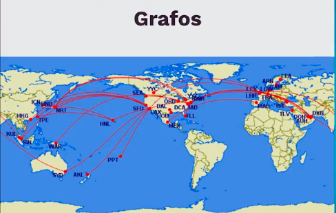

# Esctructura de Datos Lineales con Python

### Indice
- [Introducción a las estructuras de datos](#Introducción_a_las_estructuras_de_datos)
    - [Python como base de programación](#Python_como_base_de_programación)
    - [Elementos de la programación en Python](#Elementos_de_la_programación_en_Python)
    - [Tipos de colecciones](#Tipos_de_colecciones)
    - [Operaciones esenciales con colecciones](#Operaciones_esenciales_con_colecciones)
    - [Colecciones incorporadas en Python](#Colecciones_incorporadas_en_Python)
- [Arrays](#Preparar-entorno-de-trabajo)
    - [Arrays](#entidades-y-atributos)
    - [Arrays de dos dimensiones](#atributos)
- [Linked lists](#relaciones)
    - [Nodos y singly linked list](#cardinalidad-1-a-1)
    - [Crear nodos](#cardinalidad-0-a-1)
    - [Crear singly linked lists](#cardinalidad)
    - [Operaciones en single linked structures](#cardinalidad-1-a-1)
    - [Operaciones a detalle](#cardinalidad-0-a-1)
    - [Circular linked list](#cardinalidad)
- [Stacks](#relaciones)
    - [Qué son stacks?](#cardinalidad-1-a-1)
    - [crear stack](#cardinalidad-0-a-1)
- [Queues](#relaciones)
    - [Qué son los queues?](#cardinalidad-1-a-1)
    - [Queue basada en listas](#cardinalidad-0-a-1)
    - [Queue basada en dos stacks](#cardinalidad-1-a-1)
    - [Queue basada en nodos](#cardinalidad-0-a-1)
    - [Reto: simulador de playlists musical](#cardinalidad-0-a-1)
- [Próximos pasos](#relaciones)
    - [Más allá de las estructuras lineales](#cardinalidad-1-a-1)

# Introducción a las estructuras de datos

### Python como base de programación

**De aprendizaje**

- Entender el concepto e importancia de estructuras de datos
- Comprender el comportamiento, uso e interacción de estructuras de datos con python
- Poner en práctica lo aprendido.

**Por qué python**

python ayuda bastante a aplicar estos conceptos, algunos beneficios:

- sintansix clara y simple
- Semántica segura
- Escalable
- Interactivo
- Propósito general
- Gratis y popular

### Elementos de la programación en Python

**Elementos léxicos**
- if, while, def, etc


**Convenciones**
- variables
- constante
- nombre_funcion
- nombreClase


**A tomar en cuenta**
- Sintasix
- Literales
- Operadores
- Import
- Condicionales
- Loops

**Estructuras propias**

```python
[]
# An empty list
["hello!!"]
# A list of one string
["hello!!", "oops"]
# A listof two strings
["hello!!", "oops", 10]
# A listof two strings and an int
["hello!!", ["oops", 10]]
# A list with a nested list
```
**Operaciones esenciales**

**Estructuras propias**
- Listas
- Tuplas
- Conjuntos o sets
- Diccionarios

```python
items_lists = []
# items_lists is []
items_lists.append(34)
# items_lists is [34]
items_lists.append(22)
# items_lists is [34,22]
items_lists.sort()
# items_lists is [22, 34]
items_lists.pop()
# Returns 34; items_lists is [22]
items_lists.insert(1, 34)
# Returns 34; items_lists is [22, 34]
items_lists.insert(1, 55)
# Returns 34; items_lists is [22, 55, 34]
items_lists.pop(1)
# Returns 55; items_lists is [22, 34]
items_lists.remove(22)
#items_lists is [34]
items_lists.remove(55)
#raises valueError
```

**Funciones**

- Declaración y llamada
- Recursivas
- Anidadas
- High order functions
- Lambdas

**Además**

- Manejo de excepciones y errores
- Manipulación de archivos

### Tipos de colecciones

**¿Qué es una colección?**: Grupo de cero o más elementos que pueden tratarse como unidad conceptual

**Tipos de colecciones**

- Dinámicas: Aquellas que pueden crecer o disminuir su tamaño
- Inmutables: Aquellas que no van a cambiar

**Lineales**

- Ordenadas por posición
- Solo el primer elemento NO tiene predecesor.


**Ejemplo de colecciones lineales**

- Fila en el supermercado
- Pila de platos
- Checklist

**Jerárquicas**

- Ordenadas como un árbol invertido.
- Solo el primer elemento NO tiene predecesor.
- Padres e hijos


**Ejemplo de colecciones Jerárquicas**

- Sistemas de directorios.
- Índices de libros

**Grafos**

- Cada dato puede tener varios predecesores y sucesores.
- Estos de llaman "vecinos"


**Ejemplo**



**Desordenadas**

- No tienen orden particular.
- No hay predecesores o sucesores.


**Ejemplo**

- Una bolsa de canicas
- Premios de loterias

**Ordenadas**

- Impone un orden con una regla. item(i) <= item (i+1)

**Ejemplo**
- catalogo de pinturas
- Directorios telefonicos

### Operaciones esenciales con colecciones

**Operaciones**

- Tamaño
- Pertenencia
- Recorrido
- String
- Igualdad
- Concatenación
- Conversión de tipo
- Insertar
- Remover
- Reemplazar
- Acceder

```python
[]
# An empty list
["hello!!"]
# A list of one string
["hello!!", "oops"]
# A listof two strings
["hello!!", "oops", 10]
# A listof two strings and an int
["hello!!", ["oops", 10]]
# A list with a nested list
```
**Operaciones esenciales**

**Estructuras propias**
- Listas
- Tuplas
- Conjuntos o sets
- Diccionarios

```python
def pyramid_sum(lower, upper, margin=0):
    blanks = " " * margin
    print(blanks, lower, upper)
    if lower > upper:
        print(blanks, 0)
        return 0
    else:
        result = lower + pyramid_sum(lower + 1, upper, margin + 4)
        print(blanks, result)
        return result

(env) λ py pyramid_sum.py
 1 4
     2 4
         3 4
             4 4
                 5 4
                 0
             4
         7
     9
 10

```

### Colecciones incorporadas en Python

**Listas**
- Propósito general
- Estructura más utilizada.
- Tamaño dinámico
- De tipo secuencial
- Ordenable.

**Tuplas**
- Inmutables (No se pueden añadir o cambiar)
- Útiles para datos constantes.
- Más rápidas que las listas
- Tipo secuencial

```python
tuple1 = ()
tuple2 = (1274, 1275, 1276)
tuple3 = 'mulan','pucca', 'percy',

print(tuple1)
print(tuple2)
print(tuple3)

>>> ()
>>> (1274, 1275, 1276)
>>> ('mulan','pucca', 'percy')
```

**Conjuntos/Sets**

- Almacenen objetos no-duplicados
- De acceso rápido
- Aceptan operaciones lógicas
- Son desordenados.

**Ejemplo**
- Receta de cocina

```python
set1 = {3, 5, 9, 3, 9}
set2 = set()
numbers = [1, 2, 3, 4, 5, 6, 1, 2]
set3 = set(numbers)

print(set1)
print(set2)
print(set3)

>>> { 9, 3, 5}
>>> set()
>>> {1, 2, 3, 4, 5, 6}
```