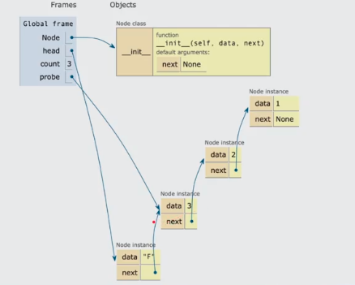

# Esctructura de Datos Lineales con Python

### Indice
- [Introducción a las estructuras de datos](#Introducción_a_las_estructuras_de_datos)
    - [Python como base de programación](#Python_como_base_de_programación)
    - [Elementos de la programación en Python](#Elementos_de_la_programación_en_Python)
    - [Tipos de colecciones](#Tipos_de_colecciones)
    - [Operaciones esenciales con colecciones](#Operaciones_esenciales_con_colecciones)
    - [Colecciones incorporadas en Python](#Colecciones_incorporadas_en_Python)
- [Arrays](#Arrays)
    - [Arrays](#Arrays)
    - [Arrays de dos dimensiones](#Arrays_de_dos_dimensiones)
- [Linked lists](#Linked_lists)
    - [Nodos y singly linked list](#Nodos_y_singly_linked_list)
    - [Crear nodos](#Crear_nodos)
    - [Crear singly linked lists](#Crear_singly_linked_lists)
    - [Operaciones en single linked structures](#Operaciones_en_single_linked_structures)
    - [Operaciones a detalle](#Operaciones_a_detalle)
    - [Circular linked list](#Circular_linked_list)
- [Stacks](#Stacks)
    - [Qué son stacks?](#Que_son_stacks)
    - [crear stack](#crear_stack)
- [Queues](#Queues)
    - [Qué son los queues?](#Que_son_los_queues)
    - [Queue basada en listas](#Queue_basada_en_listas)
    - [Queue basada en dos stacks](#Queue_basada_en_dos_stacks)
    - [Queue basada en nodos](#Queue_basada_en_nodos)
    - [Reto: simulador de playlists musical](#simulador_de_playlists_musical)
- [Próximos pasos](#Próximos_pasos)
    - [Más allá de las estructuras lineales](#Más_allá_de_las_estructuras_lineales)

# Introducción a las estructuras de datos

### Python como base de programación

**De aprendizaje**

- Entender el concepto e importancia de estructuras de datos
- Comprender el comportamiento, uso e interacción de estructuras de datos con python
- Poner en práctica lo aprendido.

**Por qué python**

python ayuda bastante a aplicar estos conceptos, algunos beneficios:

- sintansix clara y simple
- Semántica segura
- Escalable
- Interactivo
- Propósito general
- Gratis y popular

### Elementos de la programación en Python

**Elementos léxicos**
- if, while, def, etc


**Convenciones**
- variables
- constante
- nombre_funcion
- nombreClase


**A tomar en cuenta**
- Sintasix
- Literales
- Operadores
- Import
- Condicionales
- Loops

**Estructuras propias**

```python
[]
# An empty list
["hello!!"]
# A list of one string
["hello!!", "oops"]
# A listof two strings
["hello!!", "oops", 10]
# A listof two strings and an int
["hello!!", ["oops", 10]]
# A list with a nested list
```
**Operaciones esenciales**

**Estructuras propias**
- Listas
- Tuplas
- Conjuntos o sets
- Diccionarios

```python
items_lists = []
# items_lists is []
items_lists.append(34)
# items_lists is [34]
items_lists.append(22)
# items_lists is [34,22]
items_lists.sort()
# items_lists is [22, 34]
items_lists.pop()
# Returns 34; items_lists is [22]
items_lists.insert(1, 34)
# Returns 34; items_lists is [22, 34]
items_lists.insert(1, 55)
# Returns 34; items_lists is [22, 55, 34]
items_lists.pop(1)
# Returns 55; items_lists is [22, 34]
items_lists.remove(22)
#items_lists is [34]
items_lists.remove(55)
#raises valueError
```

**Funciones**

- Declaración y llamada
- Recursivas
- Anidadas
- High order functions
- Lambdas

**Además**

- Manejo de excepciones y errores
- Manipulación de archivos

### Tipos de colecciones

**¿Qué es una colección?**: Grupo de cero o más elementos que pueden tratarse como unidad conceptual

**Tipos de colecciones**

- Dinámicas: Aquellas que pueden crecer o disminuir su tamaño
- Inmutables: Aquellas que no van a cambiar

**Lineales**

- Ordenadas por posición
- Solo el primer elemento NO tiene predecesor.


**Ejemplo de colecciones lineales**

- Fila en el supermercado
- Pila de platos
- Checklist

**Jerárquicas**

- Ordenadas como un árbol invertido.
- Solo el primer elemento NO tiene predecesor.
- Padres e hijos


**Ejemplo de colecciones Jerárquicas**

- Sistemas de directorios.
- Índices de libros

**Grafos**

- Cada dato puede tener varios predecesores y sucesores.
- Estos de llaman "vecinos"


**Ejemplo**


**Desordenadas**

- No tienen orden particular.
- No hay predecesores o sucesores.


**Ejemplo**

- Una bolsa de canicas
- Premios de loterias

**Ordenadas**

- Impone un orden con una regla. item(i) <= item (i+1)

**Ejemplo**
- catalogo de pinturas
- Directorios telefonicos

### Operaciones esenciales con colecciones

**Operaciones**

- Tamaño
- Pertenencia
- Recorrido
- String
- Igualdad
- Concatenación
- Conversión de tipo
- Insertar
- Remover
- Reemplazar
- Acceder

```python
[]
# An empty list
["hello!!"]
# A list of one string
["hello!!", "oops"]
# A listof two strings
["hello!!", "oops", 10]
# A listof two strings and an int
["hello!!", ["oops", 10]]
# A list with a nested list
```
**Operaciones esenciales**

**Estructuras propias**
- Listas
- Tuplas
- Conjuntos o sets
- Diccionarios

```python
def pyramid_sum(lower, upper, margin=0):
    blanks = " " * margin
    print(blanks, lower, upper)
    if lower > upper:
        print(blanks, 0)
        return 0
    else:
        result = lower + pyramid_sum(lower + 1, upper, margin + 4)
        print(blanks, result)
        return result

(env) λ py pyramid_sum.py
 1 4
     2 4
         3 4
             4 4
                 5 4
                 0
             4
         7
     9
 10

```

### Colecciones incorporadas en Python

**Listas**
- Propósito general
- Estructura más utilizada.
- Tamaño dinámico
- De tipo secuencial
- Ordenable.

**Tuplas**
- Inmutables (No se pueden añadir o cambiar)
- Útiles para datos constantes.
- Más rápidas que las listas
- Tipo secuencial

```python
tuple1 = ()
tuple2 = (1274, 1275, 1276)
tuple3 = 'mulan','pucca', 'percy',

print(tuple1)
print(tuple2)
print(tuple3)

>>> ()
>>> (1274, 1275, 1276)
>>> ('mulan','pucca', 'percy')
```

**Conjuntos/Sets**

- Almacenen objetos no-duplicados
- De acceso rápido
- Aceptan operaciones lógicas
- Son desordenados.

**Ejemplo**
- Receta de cocina

```python
set1 = {3, 5, 9, 3, 9}
set2 = set()
numbers = [1, 2, 3, 4, 5, 6, 1, 2]
set3 = set(numbers)

print(set1)
print(set2)
print(set3)

>>> { 9, 3, 5}
>>> set()
>>> {1, 2, 3, 4, 5, 6}
```

**Diccionarios/Dictionaries**

- Pares de llave / valor
- Arrays asociativos (hash maps)
- Son desordenados

```python
cats1 = {
    'mulan': 2,
    'pucca': 1.2,
    'percy': 4,
}

cats2 = dict([('mulan', 2), ('pucca', 1.2), ('percy', 4)])
cats3 = dict(mulan=2, pucca=1.2, percy=4)

print(cats1)
print(cats2)
print(cats3)

>>> { 'mulan': 2, 'pucca': 1.2}
```

**¿En qué casos usarías cada estrutura?**

Listas: guardar informacion 
Tuplas : guardar paises
Conjuntos: juego loteria
Diccionarios: guradar información de un formulario

**¿Qué tipo de información guardarías?**
Listas

```python 
set1 = {'nombre', 23}
```

Tuplas:

```python 
tuple3 = 'Colombia','México', '',
```
Conjuntos:

```python 
set1 = {3, 5, 9, 3, 9}
```

Diccionarios: 

```python 
cats1 = {
    'nombre': 'Juan valdez',
    'edad': 94,
    'ciudad': 'México,
}
```

# Arrays

### Arrays

Estructura de dato lineal

**¿Qué es una estructura de datos?**

Representación interna de una colección de información.

**Conceptos clave**
- **Elemento:** valor almacenado en las posiciones del array
- **Índice:** referencia a la posición del elemento

Esta es la memoria en la computadora, de forma conceptual se observaria de esta manera


Podemos ocupar una o multiples casillas, aqui podemos ver como se guardaria esta variable en memoria


conforme a como vamos agregando información esto se pone de forma consecutiva.


Los **arrays** van a guardar información de forma consecutiva, y tiene ciertas restricciones como al momento de guardar la información yo no voy a poder guardar mas de la que me permite el array, en cambio una **lista** en python se puede guardar de manera dinamica y la información no va a ser consecutiva si no que va a estar dispersa en la memoria.


- el array tiene una capacidad y es el número de elementos que puede almacenar su tamaño.
- hay distintos tipos de arrays


**se recomienda no trabajar en estructura de datos de mas de dos dimensiones**

**¿Los arrays son listas?**

Respuesta si los arrays son un tipo de lista pero las listas no son arrays

**Los arrays son restrictivos**
No pueden:
- Agregar posiciones
- Remover posiciones
- Modificar su Tamaño
- Su capacidad se define al crearse.

**Donde se usan**
- Un videjuego con sprites de 100x100 px.
- Opciones en un menú

**crear nuestro propio array**

Metódos:
- Crearse
- Longitud
- Representación de string
- Pertenencia
- índice
- Reemplazo


> ver codigo adjunto array.py

### Arrays de dos dimensiones

**Otros nombres**
- Bi-dimensional array
- Two-dimensional array
- Grid
- Rejilla
- Malla
- Tabla

**Estructura**

Tenemos filas y columnas y dentro de estas valores


> archivo adjunto grid.py

# Linked lists

### Nodos y singly linked list

Tambien conocidas como **linked structures**
- Consiste de nodos conectados a otros
- Los más comunes son sencillos o dobles
- No se acceden por indices, si no por recorrido

**Conceptos claves**
- **Data:** valor almacenado en nodos.
- **Next:** referencia al siguiente nodo.
- **Previous:** referencia al nodo anterior.
- **Head:** referencia al primer nodo.
- **Tail:** referencia al último nodo.


Los datos en los nodos estan repartidos en la memoria no son contiguos como los arrays entonces para poder hacer referencia a otro dato utilizamos los nodos que son otros datos que van a estar almacenados en otro espacio en memoria y el siguiente en otro diferente que no es continuo esto nos da la ventaja de que podemos acceder a los datos saltando en los espacios de memoria de una forma muchisimo mas agil que tener que usar una lista que deba de buscarlos.

**Implementación**

- Implementar otras estructuras
- Optimización

**Singly Linked Structure**


En una serie de nodos el ultimo nodo nos va a llevar a None


Estos tienen un comportamiento diferente uno nodo puede hacer referencia a otro nodo en la siguiente lista y al anterior de esta forma podemos recorrer la lista en un sentido y en el otro.

**Ejemplo de linked lists**

- Hacer/rehacer operaciones en un editor de texto.
- Historial de un navegador.

### Crear nodos

**Singly linked list con nodos**
- Crear una clase Node
- Referimos valores
- Unimos nodos iterando

```python 
class Node():

    """ En una serie de nodos el ultimo nodo nos va a llevar a None """
    def __init__(self, data, next=None):
        self.data = data
        self.next = next

"""
>>> from node import Node
>>> node1 = None
>>> node2 = Node("A", None)
>>> node3 = Node("B", node2)
>>> node2
<node.Node object at 0x00000216BCE62530>
>>> node2.data
'A'
>>> node2.next
>>> node3.next
<node.Node object at 0x00000216BCE62530>
>>> node3.next.data
>>> node3.next.data
'A'
>>> node1
>>> node1.next
Traceback (most recent call last):
  File "<stdin>", line 1, in <module>
AttributeError: 'NoneType' object has no attribute 'next'
>>> node1 = Node("C", node3)
>>> node1.next.data
'B'
>>> node1.data
'C'
>>> head = None
>>> for count in range(1,5):
...     head = Node(count, head)
...
>>> while head != None:
...     print(head.data)
...     head = head.next
...
4
3
2
1
"""
```
**Entendiendo el codigo**

Creamos tres nodos node1, node2 y node3. Node1 apuntaba a None mientras node2 apuntaba a la dirección en memoria del siguiente nodo al que se conectaba y el tercer nodo tenia un valor y hacia referencia al segundo nodo.


Luego cambiamos las referencias


Con el ciclo while realizamos una serie de nodos que hacian referencias unos a otros. a 
su vez estos nodos se conectaban a los otros.


> adjunto codigo node.py

### Crear singly linked lists

```python
"""
Code used for the class 'Nodos y singly linked list'.

All the code but the 'Node' class is written in the shell
for demonstrative purposes.

The node methods should be incorporated into the Node class.
"""
from node import Node

class SinglyLinkedList:
    def __init__(self):
        self.tail = None
        self.size = 0
    
    def append(self, data):
        node = Node(data)

        if self.tail == None:
            self.tail = node
        else:
            current = self.tail

            while current.next:
                current = current.next
            
            current.next = node

        self.size +=1
    
    def size(self):
        return str(self.size)
    
    def iter(self):
        current = self.tail

        while current:
            val = current.data
            current = current.next
            yield val
    
    def delete(self, data):
        current = self.tail
        previous = self.tail

        while current:
            if current.data == data:
                if current == self.tail:
                    self.tail = current.next
                else:
                    previous.next = current.next
                    self.size -= 1
                    return current.data
            
            previous = current
            current = current.next
    
    def search(self, data):
        for node in self.iter():
            if data == node:
                print(f"Data {data} found!")
    
    def clear(self):
        self.tail = None
        self.head = None
        self.size = 0


"""
λ py
Python 3.10.4 (tags/v3.10.4:9d38120, Mar 23 2022, 23:13:41) [MSC v.1929 64 bit (AMD64)] on win32
Type "help", "copyright", "credits" or "license" for more information.
>>> from linked_list import SinglyLinkedList
>>> words = SinglyLinkedList()
>>> words.append('egg')
>>> words.append('ham')
>>> words.append('spam')
>>> current = words.tail
>>> while current:
...     print(current.data)
...     current = current.next
...
egg
ham
spam
>>> for word in words.iter():
...     print(word)
...
egg
ham
spam
>>> words.search('spam')
Data spam found!
>>> words.search('juice')
>>> words.clear()
>>> while current:
...     print(current.data)
...
"""
```

### Operaciones en single linked structures

```python
# creando una serie de nodos del 1 al 6
>>> from node import Node       
>>> head = None                 
>>> for count in range(1, 6):   
...     head = Node(count, head)
... 
# verificando que se hayan creado                            
>>> while head!= None:
...     print(head.data)
...     head = head.next
...
5
4
3
2
1
>>> probe = head
>>> while probe!= None:
...     print(probe.data)
...     probe = probe.next
...
"""No imprime nada porque probe es un puntero temporal"""
>>> probe = head
>>> target_item = 2
>>> while probe != None and target_item != probe.data:
...     probe = probe.next
...
>>> if probe != None:
...     print(f"Target item {target_item} has been found")
... else:
...     print(f"Target item {target_item} is not in the linked list")
...
Target item 2 is not in the linked list
>>> probe = head
>>> target_item = 3
>>> new_item = "Z"
>>> while probe != None and target_item != probe.data:
...     probe = probe.next
...
>>> if probe != None:
...     probe.data = new_item
...     print(f"{new_item} replaced the old value in the node number {target_item}")
... else:
...     print(f"The target item {target_item} is not in the linked list")
...
The target item 3 is not in the linked list
# insertar un nuevo elemento o un nuevo nodo al inicio de nuestra lista
>>> head = Node("F", head)
>>> new_node = Node("k")
>>> if head is None:
...     head = new_node
... else:
...     probe = head
...     while probe.next != None:
...             probe = probe.next
...     probe.next = new_node
...
# eliminar un nodo
>>> removed_item = head.data
>>> head = head.next
>>> print(removed_item)
F
# eliminar elemento al final
>>> removed_item = head.data
>>> if head.next is None:
...     head = None
... else:
...     probe = head
...     while probe.next.next != None:
...             probe = probe.next
...     removed_item = probe.next.data
...     probe.next = None
...
>>> print(removed_item)
k
# añadir metodo en posición determinada
>>> new_item = input("Enter new item: ")
Enter new item: 10
>>> index = int (input("Enter the position to insert the new item: "))
Enter the position to insert the new item: 3
>>> if head is None or index < 0:
...     head = Node("Py", head)
... else:
...     probe = head
...     while index > 1 and probe.next != None:
...             probe = probe.next
...             index -=1
...     probe.next = Node(new_item, probe.next)
...
# Eliminar un nodo de una posición determinada
>>> index = 3
>>> if index <= 0 or head.next is None:
...     removed_item = head.data
...     head = head.next
...     print(removed_item)
... else:
...     probe = head
...     while index > 1 and probe.next.next != None:
...             probe = probe.next
...             index -= 1
...     removed_item = probe.next.data
...     probe.next = probe.next.next
...     print(removed_item)
...
Py
```

### Operaciones a detalle

Usamos la variable auxiliar probe esta nos ayudaba a conocer que habia dentro de cada uno de los nodos


Los fue recorriendo y cuando habia una condición especifica se detenia y obtenia la información


Lo que hicimos fue relacionar una serie de nodos uno con el siguiente 


Una vez definidos comenzamos a realizar estas operaciones: 

Primera operacion la **busqueda** 


La cual consistia de que de nuestra lista de nodos la variable probe hiba visitando cada uno de estos por ejemplo: si buscamos el elemento con valor 2 lo que  va a ser es que cuando encuentre ese valor ejecutaba la operación en nuestro caso decir si encontro dicho valor.

**Reemplazo**

Consiste a que a ese metodo le demos un argumento lo busque y lo reemplace por otro.



**Insertar nodo al inicio**

Los nodos no tienen indice entonces el nodo que insertemos al inicio va a ser head y el anterior head ya no va a ser ese nodo inicial ahora va a ser head.next y es alli donde tenemos que pensar como reposicionar estos nodos para que no tengamos problemas


**Insertar nodo al final**

El nodo que voy a insertar va a tener el valor de k y va a apuntar al None mientras que el nodo 3 va a apuntar al nodo dos y el nodo dos va a apuntar al nodo 1 y el nodo 1 va a apuntar el valor de k


**Eliminar el primer nodo**

Debemos ubicarnos sobre ese nodo o valor a eliminar


**Eliminar el ultimo nodo**


**Insertar en cualquier posición**

Si queremos insertar un nodo en n posición tenemos que saber donde lo vamos a ubicar, puede ser a travez del valor o la variable iteradora, nosotros buscamos aquel nodo que tubiera como valor tres, ese nodo ahora va a insertar al nuevo que ahora contiene la palabra py y este nodo ahora va a apuntar al dato dos hay que posicionar los punteros nuevamente


**Eliminar en cualquier posición**

Hay que recorrerlo, buscarlo y hay que eliminarlo


### Circular linked list

Las listas enlazadas circulares son un tipo de lista enlazada en la que el último nodo apunta hacia el headde la lista en lugar de apuntar None. Esto es lo que los hace circulares.


```python
>>> from node import Node
>>> index = 1
>>> new_item = 'ham'
>>> head = Node(None, None)
>>> head.next = head
>>> probe = head
>>> while index > 0 and probe.next != head:
...     probe = probe.next
...     index -= 1
...
>>> probe.next = Node(new_item, probe.next)
>>> print(probe.next.data)
ham
>>>
```
creamos un solo nodo y este se referenciaba asi mismo 


