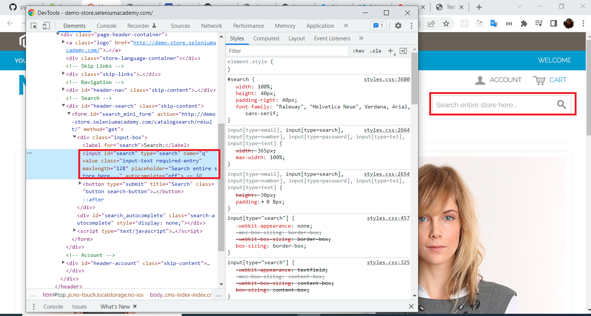
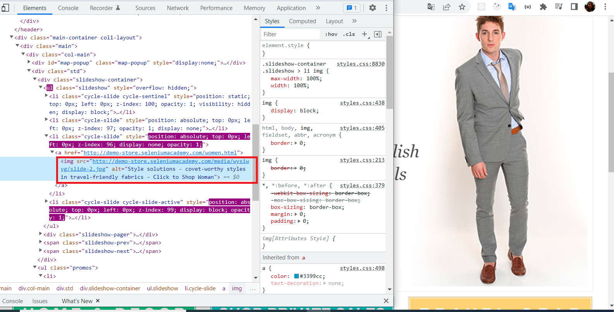

# Introducción a selenium con Python

### Indice
- [Conocer el ecocistema de selenium](#Conocer-el-ecocistema-de-selenium)
    - [Por qué aprender Selenium y qué verás](#Por-qué-aprender-Selenium-y-qué-verás)
    - [Historia de Selenium](#Historia-de-Selenium)
    - [Otras herramientas de testing y automatización](#Otras-herramientas-de-testing-y-automatización)
- [Preparar entorno de trabajo](#Preparar-entorno-de-trabajo)
    - [Configurar entorno de trabajo](#entidades-y-atributos)
    - [Compatibilidad con python 3.9 y aprendiendo a utilizar múltiples versiones](#atributos)
    - [¡Hola, mundo!](#entidades)
- [Utilizar comandos básicos](#relaciones)
    - [Encontrar elementos con find_element](#cardinalidad-1-a-1)
    - [Preparar assertions y test suites](#cardinalidad-0-a-1)
    - [Entender las clases WwebDriver y WebElement](#cardinalidad)
- [Interactuar con elementos](#relaciones)
    - [Manejar form, textbox, checkbox y radio button](#cardinalidad-1-a-1)
    - [Manejar dropdown y listas](#cardinalidad-0-a-1)
    - [Manejar alert y pop-up](#cardinalidad)
    - [Automatizar navegación](#cardinalidad-1-a-1)
- [Sincronizar pruebas](#relaciones)
    - [Demora implícita y explícita](#cardinalidad-1-a-1)
    - [Condicionales esperadas](#cardinalidad-0-a-1)
- [Retos](#relaciones)
    - [Agregar y eliminar elementos](#cardinalidad-1-a-1)
    - [Elementos dinámicos](#cardinalidad-0-a-1)
    - [Controles dinámicos](#cardinalidad)
    - [Typos](#cardinalidad-1-a-1)
    - [Ordenar tablas](#cardinalidad)
- [Metodologías de Trabajo](#relaciones)
    - [Data Driven Testing (DDT)](#cardinalidad-1-a-1)
    - [Page Object Model (POM)](#cardinalidad-0-a-1)
- [Cierre del curso](#relaciones)
    - [Realizar pruebas técnicas](#cardinalidad-1-a-1)
    - [Conclusiones](#cardinalidad-0-a-1)

# Conocer el ecocistema de selenium

### Por qué aprender Selenium y qué verás

**¿Qué aprenderas?**

- Entender ¿Qué es Selenium? 
- Comunicar selenium con el navegador
- Automatizar pruebas unitarias y funcionales
- Generar reportes de pruebas

### Historia de Selenium

**¿Qué es Selenium?:** "Suite de herramientas para automatización de navegadores".

Es compatible con diversos navegadores web como:

Actualmente selenium es compatible con distintos lenguajes de programación

Selenium No es una herramienta de 
- Testing
- Web Scraping

**Todo comienza en 2004**

- Jason Huggins buscaba automatizar pruebas manuales, creando asi una aplicación llamada "JavaScriptTestRunner". Despues llamada "Selenium Core"

- Paul Hammant vio el demo y buscó una solución a la "Same Origin Policy" y creo "Selenium RC".

- Shinya Katasani en Japón envolvió el código de Selenium convirtiéndolo en un plugin para Firefox.

- Selenium IDE es capaz de grabar, repetir, importar y esportar automatizaciones

- Simon Stewart trabajó en varias herramientas llamadas "WebDriver". Reemplazando JS por un cliente para cada navegador y una API de alto nivel.

- Selenium RC se fusionó a este proyecto, dando lugar a Selenium WebDriver.

**Características, pros y contras**

**Selenium IDE**

**Pros**
- Excelente para iniciar
- No require saber programar
- Exporta scripts para Selenium RC y Selenium WwebDriver
- Genera reportes

**Contras**
- Disponible solo para Firefox y chrome
- No soporta DDT

**Selenium RC**

**Pros**
- Soporta para: 
    - Varias plataformas, navegadores y lenguajes
    - Operaciones logicas y condicionales
    - DDT
- Posee una API madura

**Contras**
- Complejo de instalar
- Necesita de un servidor corriendo
- Comandos redundantes en su API
- Navegación no tan realista

**Selenium WebDriver**

**Pros**
- Soporta para múltiples lenguajes
- Fácil de instalar
- Comunicación directa con el navegador
- Interacción más realista

**Contras**
- No soportan nuevos navegadores tan rápido
- No genera reportes o resultados de pruebas
- Requiere de saber programar

**Selenium Grid**

**características**
- Se utiliza junto a Selenium RC
- Permite correr pruebas en paralelo
- Conveniente para ahorrar tiempo

### Otras herramientas de testing y automatización

**Puppeteer**

**Pros**

- Soporte por parte de Google
- Datos del Performance Analysis de Chrome
- Mayor control de Chrome
- No requiere de drivers externos

**Contras**

- Funciona solo en Chrome con JavaScript
- Comunidad pequeña

**Cypress.io**

**Pros**
- Comunidad emergente
- Buena documentación con ejemplos
- Bastante ágil en pruebas E2E
- Orientado a desarrolladores
- Excelente manejo de asincronismo

**Contras**
- Funciona solo en Chrome y con JavaScript
- Pruebas en paralelo solo en versión pago

# Preparar entorno de trabajo

### Configurar entorno de trabajo

Pasos
- Para ver la version que tenemos instalada de python en windows usamos el comando: py --version

- Creamos un ambiente virtual ejecutando los comandos a continuación, y usamos pip para descargar paquetes para instalar selenium y pyunitreport

- pip freeze muestra todos los paquetes instalados en tu ambiente virtual

### Compatibilidad con Python 3.9 y aprendiendo a utilizar múltiples versiones

**Compatibilidad de Selenium con Python 3.9**

Durante este curso utilizaremos Selenium 3, la cual de momento no es compatible con Python 3.9 y no será sino Selenium 4 que nos brindará esta compatibilidad cuando sea lanzado, ya que por ahora se encuentra en una versión alpha.

Lo recomendable es que durante el curso utilices Python en una versión entre 3.6 y 3.8, puede sonar un poco extraño trabajar con versiones anteriores a la más reciente y en esta clase te enseñaré a manejar distintas versiones de Python en tu equipo.

En caso de que tengas una versión de Python inferior a 3.9 compatible con Selenium 3 puedes omitir los siguientes pasos y continuar con el curso. Recuerda que como buena práctica todo lo que instales a través de pip debe ser en un entorno virtual.

**¿Por qué utilizar pyenv y entornos virtuales?**

Sí, puedes instalar una versión distinta directo en tu sistema, continuar con el curso (quizá lo termines sin problemas) y pretender que no ha sucedido nada. Sin embargo cuando instalas una versión de Python directo al sistema operativa esta funcionará de forma global y lo mismo con los módulos que instales a través de pip (a no ser que uses un entorno virtual).

Cuando instales paquetes de forma global en cada versión de Python en tu sistema, es probable que estos lleguen a ser de versiones distintas y es aquí cuando los problemas se pueden presentar. Por ello es mejor tener cada cosa en su lugar, separada y sin afectar otros entornos.

**¿Qué versión de Python tengo instalada y dónde?**

Utilizar distintas versiones de Python en tu equipo puede generar problemas cuando haces uso de pip para instalar paquetes, pues estos se instalan de forma global y al haber versiones distintas del mismo te expones a errores. Recuerda que como buena práctica lo mejor es instalar paquetes en entornos virtuales.

Para saber donde está instalado Python en tu equipo ejecutas el siguiente comando desde tu terminal:

`λ which python`

Te dará como resultado algo similar a esto:

**/c/Python27/python**

Si quieres saber exactamente que versión de Python está instalada en tu sistema operativo, ejecuta el siguiente comando:

`λ python --version`

Esto te mostrará exactamente la versión de tu sistema:

Python 2.7.18

1. **Instalando dependencias**

Lo ideal es utilizar pyenv pues nos permite levantar Python desde su fuente, para lo cual debemos instalar ciertas dependencias de acuerdo a nuestro sistema operativo:

- macOS

En caso de tener macOS Mojave o superior (+10.14) debes utilizar el siguiente comando con Homebrew instalado:

`sudo installer -pkg /Library/Developer/CommandLineTools/Packages/macOS_SDK_headers_for_macOS_10.14.pkg -target /`

Si es una versión inferior, será el siguiente comando:

`brew install openssl readline sqlite3 xz zlib.`

- Distribuciones Linux

Según la distribución de tu equipo será el comando que utilizarás:

- Debian/Ubuntu

`sudo apt-get install -y make build-essential libssl-dev zlib1g-dev \
libbz2-dev libreadline-dev libsqlite3-dev wget curl llvm libncurses5-dev \
libncursesw5-dev xz-utils tk-dev libffi-dev liblzma-dev python-openssl`

- Fedora/CentOS/RHEL

`sudo yum install zlib-devel bzip2 bzip2-devel readline-devel sqlite \
sqlite-devel openssl-devel xz xz-devel libffi-devel`

- openSUSE

`zypper in zlib-devel bzip2 libbz2-devel libffi-devel \
libopenssl-devel readline-devel sqlite3 sqlite3-devel xz xz-devel`

- Windows

Actualmente pyenv no cuenta con soporte para Windows, así que lo mejor será utilizar WSL (Windows Subsystem for Linux)

2. **Instalando pyenv y Python**

Instalar pyenv es muy sencillo, solo debes ejecutar este comando en tu terminal:

`curl https://pyenv.run | bash`

Posterior a instalar pyenv reinicia tu terminal para continuar.

**Listar versiones de Python**

Lo ideal es instalar una versión de Python entre 3.6 y 3.8, puedes ver la lista disponible con este comando una vez instalado pyenv:

`pyenv install --list | grep " 3\.[678]"`

Después solo debes elegir, por ejemplo acá elegimos Python 3.8.6:

`pyenv install -v 3.8.6`

Con esto pyenv procederá a levantar la versión de Python desde su fuente indicada y realizar las descargas necesarias, por lo que puede tomar unos minutos.

**Verificando versiones instaladas**

Puedes saber que versiones de Python has instalado mediante pyenv con este comando:

`ls ~/.pyenv/versions/`

**Desinstalando versiones de Python**

Ok, esto será necesario en algún momento y es posible con un sencillo comando donde solo debes especificar la versión a remover:

`lpyenv uninstall 3.8.6`

3. **Utilizando las nuevas versiones instaladas**

**¿En qué versión me encuentro?**

Ser consciente de que versión de Python es importante, así podemos utilizar las herramientas que son compatibles (como Selenium) y el comando indicado es el siguiente:

`pyenv versions`

Esto mostrará tanto nuestra versión instalada en el sistema operativa, su ruta y las que instalamos con pyenv. Podrás ver que está marcado con un * aquella que está activa de momento. Esto se puede validar con el comando

`python --version.`

También puedes saber la ruta de la versión de Python tiene activa pyenv con el comando `pyenv which python.`

**Cambiando de versión**

Suponiendo que tenemos instalado Python 3.9, ya instalamos Python 3.8 con pyenv y queremos cambiar solo hay que ejecutar el siguiente comando:

`pyenv global 3.8.6`

Puedes verificarlo ejecutando el comando `python --version` el cual te mostrará la versión activa.

**Volviendo a la versión del sistema operativo**

En caso de necesitar volver a la versión de nuestro sistema operativo solo ejecutamos este comando:

`pyenv global system`

**Definiendo una versión por defecto en directorios**

En ocasiones deberás trabajar con una versión específica para tu proyecto, así que lo mejor es que pyenv sepa de cuál se trata y cada vez que trabajes desde un directorio esté activada. Esto lo puedes realizar con el comando local, por ejemplo, supongamos que queremos Python 3.7.6 por defecto entonces ejecutamos este comando:

`pyenv local 3.7.6`

Esto generará el archivo .python_version, mismo que fijará la versión 3.7.6 de Python en el directorio donde se ubique y todos los demás que se contengan en este. Si lo eliminas, entonces podrás cambiar entre versiones con el comando global.

4. **Utiliza una versión de Python específica en un entorno virtual**

Nuestra versión de Python específica está lista para funcionar, lo siguiente es crear un entorno virtual con pyenv donde trabajaremos con esta y poder realizar la instalación de cualquier módulo con pip.

Considera que pyenv nos permite manejar y cambiar entre distintas versiones de Python, los entornos virtuales aislan las instalaciones de diversos módulos y juntos nos permiten aislar módulos para versiones específicas de Python.

**Seleccionemos una versión de Python**

Lo primero será ubicarnos al directorio donde estarán nuestro proyecto y elegir la versión preferida con el comando local (de preferencia), por ejemplo 3.8.6:

`pyenv local 3.8.6`

**Creando el entorno virtual**

Generar un nuevo entorno local es posible con la siguiente convención:

`pyenv virtualenv <version_de_python> <nombre_del_entorno>`

Siguiendo el ejemplo de Python 3.8.6 lo haremos así:

`pyenv virtualenv 3.8.6 curso-selenium-platzi`

Para activar nuestro entorno virtual con esta versión específica de Python solo ejecutamos el comando local con el nombre del entorno:

`pyenv local curso-selenium-platzi`

Podemos utilizar pyenv versions y pyenv which python para darnos cuenta de que estamos utilizando la versión 3.8.6 en el directorio de nuestro entorno virtual.

Incluso ahora podemos instalar Selenium de una forma aislada con el comando pip install selenium.

Para salir de nuestro entorno solo ejecutamos el comando `pyenv deactivate` y para activarlo de nuevo con pyenv activate nombre_del_entorno.

### ¡Hola, mundo!

Unittest (PyTest)

- **Test Fixture:** preparaciones para antes y después de la prueba
- **Test Case:** Unidad de codigo a probar.
- **Test Suite:** Colección de Test Cases.
- **Test Runner:** Orquestador de la ejecución
- **Test Report:** Resumen de resultados

<abbr>Para comunicar a selenium con el navegador debemos instalar el driver correspondiente</abbr>

Pasos:

- Buscar en Google chrome el driver chromedriver

Este archivo es el que nos ayudara a comunicar selenium con el navegador a tráves del código.

> observar el archivo hello_word.py adjunto.

### Encontrar elementos con find_element

En ocasiones algunos sitios pueden tener bloqueos regionales o no estar disponibles por la alta cantidad de solicitudes que llegan a tener.

Si el sitio de práctica no abre, puedes intentar ingresando a OneStepCheckout Responsive Demo.

- Estructura de un sitio web

- Selectores: Es a traves de los selectores que vamos a poder realizar las acciones para nuestras pruebas

Sitio web con la que vamos a realizar nuestras pruebas http://demo-store.seleniumacademy.com/ Madison Islan un ecommerce perfecto para practicar nuestras pruebas de autoatización

**Pasos**

- Encontrar elementos: Para encontrarlos podemos hacer uso de nuestro inspector en el navegador web.

- Escribir codigo para poder acceder a esta barra de busqueda.

> observar el archivo HomePageTest.py adjunto.

Caso especial cuando no tenemos **id** ni **class** para referenciar un elemento, tenemos la opción de usar **xpath**

### Preparar assertions y test suites

Podemos hacer uso de assertions y test suites para que nuestras pruebas sean mas efectivas

**Assertions**

Método que permiten validar un valor esperando en la ejecución del test. Si el resultado en la ejecución del test. si el resultado es verdadero el test continúa, en caso contrario "falla" y termina.

> **Ejemplo: ** AssertEqual(price.text, "300")

**Test suites**

Colección de test unificados en una sola prueba, permitiendo tener resultados grupales e individuales.

**ver archivos**
>assertions.py - searchtests.py y nuestro test suite smoketests.py

### Entender las clases WebDriver y WebElement

Como viste en clases anteriores, un sitio web se construye por código HTML en forma de árbol, conteniendo distintos elementos con los que podemos interactuar según estén presentes o no en nuestra interfaz gráfica.

Selenium WebDriver nos brinda la posibilidad de poder referirnos a estos elementos y ejecutar métodos específicos para realizar las mismas acciones que un humano haría sobre los mismos, gracias a las clases WebDriver y WebElement.

#### Clase WebDriver

Cuenta con una serie de propiedades y métodos para interactuar directamente con la ventana del navegador y sus elementos relacionados, como son pop-ups o alerts. Por ahora nos centraremos a las más utilizadas.

**Propiedades de la clase WebDriver**

Estas son las más comunes para acceder al navegador.

| Propiedad/Atributo	   | Descripción	                                                       | Ejemplo
|------------------     | -----------------------------------------------------------------------  |---------------------
| current_url	        | Obtiene la URL del sitio en la que se encuentra el navegador	           | driver.get_url
| current_window_handle | Obtiene la referencia que identifica a la ventana activa en ese momento  | driver.current_window_handle
| name	                | Obtiene el nombre del navegador subyacente para la instancia activa	   | driver.name
| orientation	        | Obtiene la orientación actual del dispositivo móvil	                   | driver.orientation
| page_source	        | Obtiene el código fuente de disponible del sitio web	                   | driver.page_source
| title	                | Obtiene el valor de la etiqueta <title> del sitio web	                   | driver.title

#### Clase WebElement

Esta clase nos permite interactuar específicamente con elementos de los sitios web como textbox, text area, button, radio button, checkbox, etc.

**Propiedades más comunes de la clase WebElement**

| Propiedad/Atributo	| Descripción	                                      | Ejemplo
|------------------     |------------------------------------------           |------------------
| size	                | Obtiene el tamaño del elemento	                  | login.size
| tag_name	            | Obtiene el nombre de la etiqueta HTML del elemento  | login.tag_name
| text	                | Obtiene el texto del elemento	                      | login.text

#### Métodos más comunes de la clase WebElement

| Método/Atributo	                    | Descripción	                                     | Ejemplo
|----------------------------------     |----------------------------------------------      |----------------------
| clear()	                            | Limpia el contenido de un textarea	             | first_name.clear()
| click()	                            | Hace clic en el elemento	                         | send_button.click()
| get_attribute(name)	                | Obtiene el valor del atributo de un elemento	     | submit_button.get_attribute(‘value’) last_name.get_attribute(max_length)
| is_displayed()	                    | Verifica si el elemento está a la vista al usuario | banner.is_displayed()
| is_enabled()	                        | Verifica si el elemento está habilitado	         | radio_button.is_enabled()
| is_selected()	                        | Verifica si el elemento está seleccionado, para el caso de checkbox o radio button | checkbox.is_selected()
| send_keys(value)	                    | Simula escribir o presionar teclas en un elemento	| email_field.send_keys(‘team@platzi.com’)
| submit()	                            | Envía un formulario o confirmación en un text area	| search_field.submit()
| value_of_css_property(property_name)	| Obtiene el valor de una propiedad CSS del elemento	| header.value_of_css_property(‘background-color’)

### Interactuar con elementos

#### Manejar form, textbox, checkbox y radio button

- Inspeccionamos la cuenta account botton de la parte superior

- Como no tenemos mucha información tomamos el XPath de la propiedad

- Una vez encontrado el elemento a traves de la propiedad **find_element_by_link_text** le pedimos al driver que encuentre en el menu de opciones el texto **Log In** y hacemos click sobre el.

- Esto nos llevara a la pantalla del login de la página y ahora lo que buscaremos es el boton para crear una cuenta nueva

Nota: como no tiene mucha información lo obtendremos a traves de su XPath

- De forma manual si hacemos clic en el botton nos llevara al proceso de registro de cuenta, en el cual hay una serie de campos de texto donde podremos escribir nuestro nombres y demas información solicitada

- A cotinuación procedemos a inspeccionarlos para saber que poner en cada uno de ellos

> archivo adjunto correspondiente a las capturas register_new_user.py

### Manejar dropdown y listas

Para poder manipular el dropdown debemos importar un nuevo submodulo de selenium

> from selenium.webdriver.support.ui import Select

> archivo adjunto select_language.py

### Manejar alert y pop-up

> archivo adjunto alerts.py

### Automatizar navegación

> archivo adjunto automatic_navigation.py

### Demora implícita y explícita

#### Demoras

**Implícita:** busca uno o varios elementos en el DOM si no se encuentra disponibles por la cantidad de tiempo asignado.

**Explícita:** utiliza condicionales de espera determinadas y continúa hasta que se cumplan.

> archivo adjunto waits.py

### Condicionales esperadas

| Expected Condition	|  Descripción	                          |  Ejemplo
| ------------------    |--------------------------------------   | ----------- 
| element_to_be_clickable(locator) |	Espera a que el elemento sea visible y habilitado para hacer clic en el mismo |	WebDriverWait(self.driver,10).until(expected_conditions.element_to_be_clickable((By.NAME,“accept_button”)))
| element_to_be_selected(element) |	Espera a que un elemento sea seleccionado |	subscription = self.driver.find_element_by_name(“terms”). WebDriverWait(self.driver, 10).until(expected_conditions.element_to_be_selected(terms)))
| invisibility_of_element_located(locator)	| Espera a que un elemento no sea visible o no se encuentre presente en el DOM |	WebDriverWait(self.driver,10).until(expected_conditions.invisibility_of_element_located((By.ID,“loading_banner”)))
| presence_of_all_elements_located(locator)	| Espera a que por lo menos uno de los elementos que se indican coincida con los presentes en el sitio |	WebDriverWait(self.driver,10).until(expected_conditions.presence_of_all_elements_located((By.CLASS_NAME,“input-text”)))
| presence_of_element_located(locator) |	Espera a que un elemento sea visible se encuentre presente en el DOM	| WebDriverWait(self.driver,10).until(expected_conditions.presence_of_element_located((By.ID,“search-bar”)))
| text_to_be_present_in_element(locator,text_) |	Espera a que un elemento con el texto indicado se encuentre presente |	WebDriverWait(self.driver,10).until(expected_conditions.text_to_be_present_in_element((By.ID,“seleorder”),“high”))
| title_contains(title)	| Espera a que la página contenga en el título exactamente como es indicado |WebDriverWait(self.driver, 10).until(expected_conditions.title_contains(“Welcome”))
| title_is(title)	| Espera a que la página tenga un título idéntico a como es indicado |	WebDriverWait(self.driver, 10).until(expected_conditions.title_is(“Welcome to Platzi”))
| visibility_of(element) |	Espera a que el elemento indicado esté en el DOM, sea visible, su alto y ancho sean mayores a cero	| first_name = self.driver.find_element_by_id(“firstname”) WebDriverWait(self.driver, 10).until(expected_conditions.visibility_of(first_name))
| visibility_of_element_located(locator)	| Espera a que el elemento indicado por su selector esté en el DOM, sea visible y que su alto y ancho sean mayores a cero |	WebDriverWait(self.driver,10).until(expected_conditions.visibility_of_element_located((By.ID,“firstname”)))

### Agregar y eliminar elementos

> archivo adjunto add_remove_elements.py

### Elementos dinámicos

Este ejemplo demuestra cuándo los elementos de una página cambian al desaparecer o reaparecer en cada carga de página.

> archivo adjunto dynamic_elements.py

### Controles dinámicos

Su funcionalidad varia de acuerdo al tiempo

> archivo adjunto dynamic_controls.py

### Typos

Validaciones para que el texto de un sitio web sea igual al esperado

> archivo adjunto typos.py

### Ordenar tablas

> Archivo adjunto tables.py

### Data Driven Testing (DDT)

Metodologia usada en el testing de software

#### TDD O DDT?

**Test Driven Development:** Desarrollar código en base a pruebas para que pueda cumplirlas.

**Data Driven Testing:** Desarrollar pruebas en base a código ya existente para validar en  qué escenarios pasan o fallan.

**Ejemplo de formulario**

| Descripción       	                | Datos de prueba	          | Salida esperada
|------------------                     |------------------           |------------------
| Colocar valores numericos en un campo	| 500000	                  | El usuario debería poder pagar y recibir mensaje de confirmación
| Colocar valores numericos y de caracteres en un campo de monto a pagar	| $500.000.00                  | El usuario debe recibir un mensaje de error indicando que coloque solo valores númericos

> Archivo adjunto search_ddt.py

Leyendo de un archivo .csv

> Archivo adjunto search_csv_ddt.py

### Page Object Model (POM)

Patrón de diseño usado en testing que nos brinda de diversos beneficios para nuestras automatizaciones.

En vez de que tengamos las pruebas en un solo archivo manejaremos archivos independientes a esto lo llamaremos **Pages**. 

#### Beneficios

- Crea un alto nivel de abstracción para minimizar cambios en las pruebas si los desarrolladores modifican el sitio.

- Crea código reuzable que se puede utilizar en múltiples pruebas

- Las pruebas son más legibles, flexibles y vigentes

> archivos test_google.py y google.page.py 